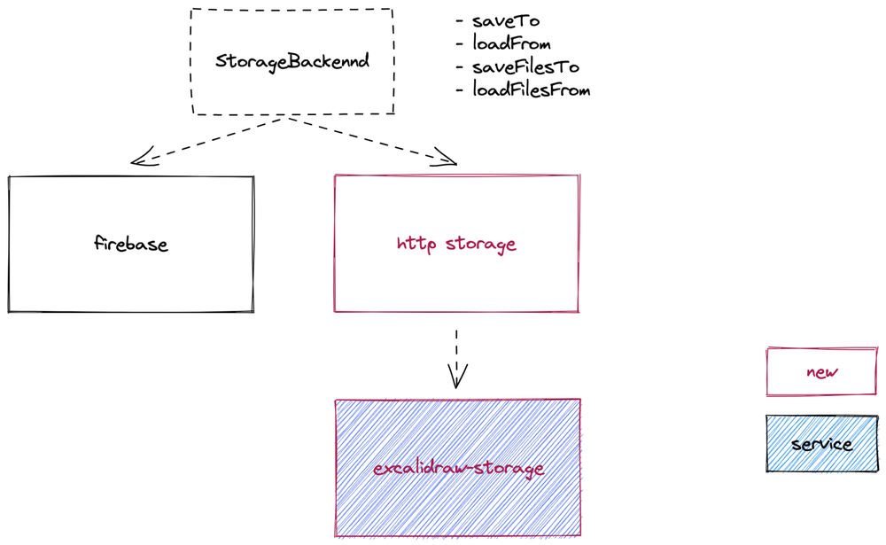
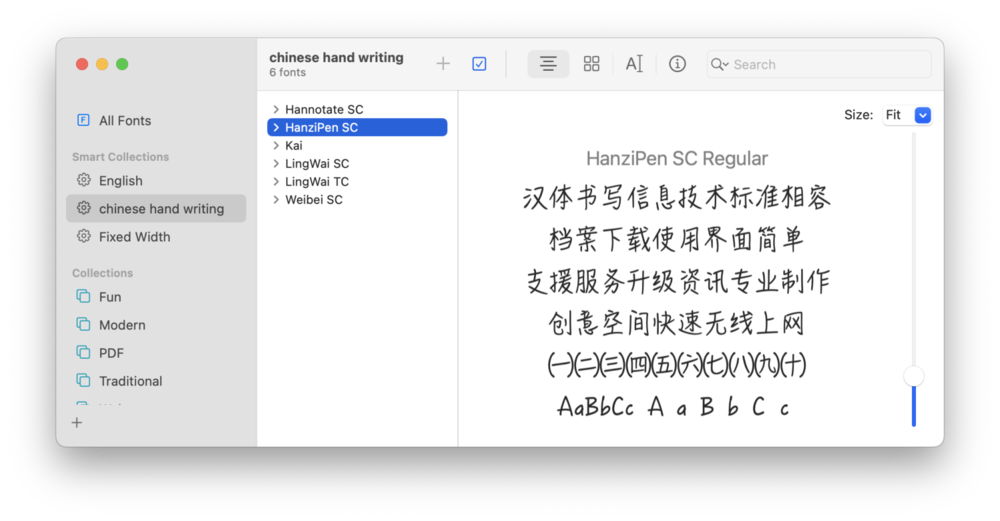

> First of all, I'd like to thank my in-laws for taking the baby for summer vacation, so I can have a weekend to develop this system.
>
> Also thanks to my wife, I did my own thing for two days during the weekend and didn't criticize me.
>
> Lastly, I would like to thank the company for the team building, providing a hotel to stay and spending a night to fix the Chinese handwriting.
>
> Note: This is the open source version of Excalidraw, thanks to the community

## #1 Excalidraw

> Introduce Excalidraw, product features

What is Excalidraw, <mark>it's (probably) the most powerful online collaborative drawing tool</mark>, you can try it by visiting [Excalidraw](https://excalidraw.com/).

If you did not want get a blank diagram, then you can also visit this public panel [Excalidraw](https://excalidraw.com/#room=e630a562422e6e9d94db,IXndkz3JfOSGrlswJRC83Q) to join in the creation.

Excalidraw works very well, I summarize a few points.

-   Hand Writing style (Hand Writing) to avoid OCD, what a pixel difference, are gone lie flat in the end
-   No delay in online collaboration, ideal for communication and collaboration in the post-epidemic era
-   The design of the product is excellent: shortcuts, object connection sticking, selected files directly to the local storage and other details are there

After this product was promoted internally by our internal partners, we quickly fell in love with it and put a lot of diagrams on Excalidraw, but it also led to a new problem.

<mark><b>Public SaaS services have data security risks</b></mark>

<mark><b> What to do? I'm going to self hosted it!</b></mark>

## #2 Before deploying, let's understand how Excalidraw works

**How Excalidraw works and how self hosted works**：

So what is the core difficulty of self hosted.

Solving the excalidraw-storage data storage problem, aka. replacing the Google Cloud Platform's firebase service.

## #3 Self hosted PoC

> If things don't work out, ask yourself
>
> \- Mencius
>
> It is better to seek from Github than to seek from yourself.
>
> \- alswl

Let's start by looking at Excalidraw's storage system.
Firebase is Google's Serverless service, formerly an independent company (and quite popular), but later acquired by GCP.

I started with the idea of replacing Firebase and found a community service [Supabase](https://supabase.com/) (found a free SaaS service, amazing)

However, after careful research, I found that Supabase's API is not compatible with firebase and <mark> cannot be simply replaced with </mark>.

Excalidraw also relies on Excalidraw+ to provide a paid service. Is there a simple and viable solution from the community? I found a bit of a solution within the community:

-   [Self hosting Excalidraw - Umbrella issue · Issue #1772 · excalidraw/excalidraw](https://github.com/excalidraw/excalidraw/issues/1772)
-   [Collaboration mode - Self-hosting vs Collab on top of · Discussion #3879 · excalidraw/excalidraw (github.com)](https://github.com/excalidraw/excalidraw/discussions/3879)

They gave a way (although it was later proven that there was still a crooked way).

-   [Kilian Decaderincourt / Excalidraw Fork · GitLab](https://gitlab.com/kiliandeca/excalidraw-fork) forked excalidraw
-   [Kilian Decaderincourt / excalidraw-storage-backend · GitLab](https://gitlab.com/kiliandeca/excalidraw-storage-backend)

So I started reviewing their solution, opened the code and saw that I had the right idea (replacing several interfaces of firebase), using my own KV storage (Redis / MySQL / Mongo) to replace it.

Attempted deployment and immediately ran into problems with:

<mark><b> Dockerfile build failed </b></mark>

<mark><b> Versions too far behind upstream (2020 -> 2022)</b></mark>

<mark><b> Merged with Rebase Unable to follow Upstream</b></mark>

What a coincidence that I'm <mark><b>Frontend Intern // Community Patching Specialist // Kubernetes Cleaner // YAML Senior Specialist </b></mark>, specializing in these few things.

## #4 Let's do it

-   [alswl/excalidraw-storage-backend: Excalidraw Backend](https://github.com/alswl/excalidraw-storage-backend)
    -   build with Dockerfile in two stages https://github.com/alswl/excalidraw-storage-backend/commit/d841d734ab02659df370a6bdef3f1d8947696580](https://github.com/alswl/excalidraw-storage-backend/commit/d841d734ab02659df370a6bdef3f1d8947696580)
    -   using Chinese mirror [feat: china mirror · alswl/excalidraw-storage-backend@30a6da9](https://github.com/alswl/excalidraw-storage-backend/commit/30a6da9c87b367bb1fbde449f754923638545fa8)
-   [alswl/excalidraw: Virtual whiteboard for sketching hand-drawn like diagrams](https://github.com/alswl/excalidraw)
    -   fix, using http stroage instead of firebase
    -   [Feat/self host backend by alswl · Pull Request #2 · alswl/excalidraw](https://github.com/alswl/excalidraw/pull/2)

<mark><b> Modification code architecture </b></mark>

## #5 Future(or not)

Excalidraw is a free version of the SaaS service, <mark><b>Excalidraw+ is a paid version </b></mark>, what's the difference?

To sum up.

-   More reliable storage, integrated to cloud storage (e.g. iCloud / NAS)
-   User identification, connected to a common identity system
-   More personalized permissions control (password access, targeted sharing), tenant control, project group control
-   Library shared within the domain
-   Integration with other systems (Yuque, Dingtalk Documents, Lark, etc.)

Or, just <mark><b>buy Excalidraw enterprise</b></mark> version!!! Less works, more enjoy.

## #6 Chinese handwriting optimization

One problem is that <mark><b> Chinese fonts are not handwritten </b></mark>, which is very incongruous. Let's see which fonts work first.

Chinese handwriting fonts supported by macOS:

-   [https://support.apple.com/zh-cn/HT212587](https://support.apple.com/zh-cn/HT212587)
-   [macOS Monterey 附带的字体 - 官方 Apple 支持 (中国)](https://support.apple.com/zh-cn/HT212587)

cursive family:

-   PanziPen
-   LingWai
-   Hannotate

Windows Chinese support for handwriting is poor, you have to install Office to have more options: 华文行楷; 方正舒体 (release in Office)

-   [https://www.zhihu.com/question/22703287](https://www.zhihu.com/question/22703287)
-   [Windows 系统内置的中文字体为什么只有那几种？不多内置几种字体呢？ - 知乎 (zhihu.com)](https://www.zhihu.com/question/22703287)
-   [https://zh.m.wikipedia.org/zh-hans/Microsoft_Windows字型列表](https://zh.m.wikipedia.org/zh-hans/Microsoft_Windows%E5%AD%97%E5%9E%8B%E5%88%97%E8%A1%A8)

If not, only the system's own italic KaiTi will work.

Finally, relying on my poor front-end level, I made a PoC and submitted a PR to the official: [feat: simple impl of multi font support, for chinese font by alswl - Pull Request #5604 - excalidraw/excalidraw] (https://github.com/excalidraw/excalidraw/pull/5604)

Here is the final result.

----

## Update 2022-12

A few users came to me to ask how to deploy it.
So based on the above solution, I provided a set of one-click pull-up services based on Docker Compose: with collaboration, Chinese font support.
See [alswl/excalidraw-collaboration](https://github.com/alswl/excalidraw-collaboration).
