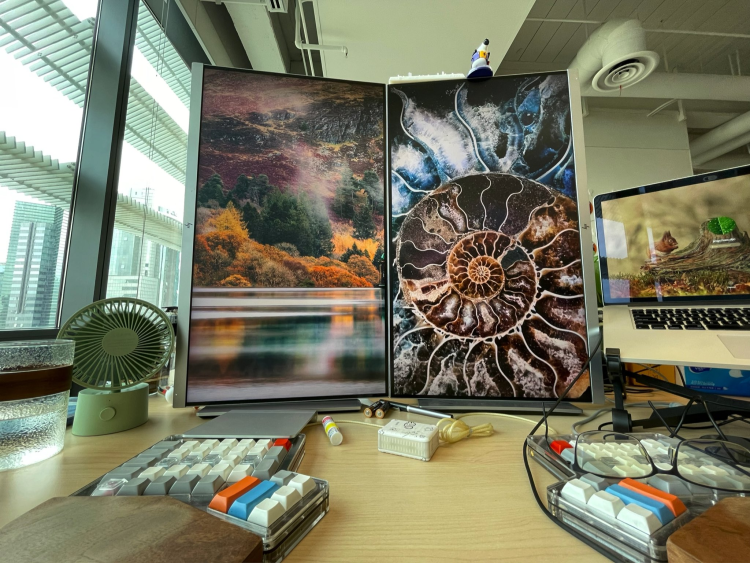
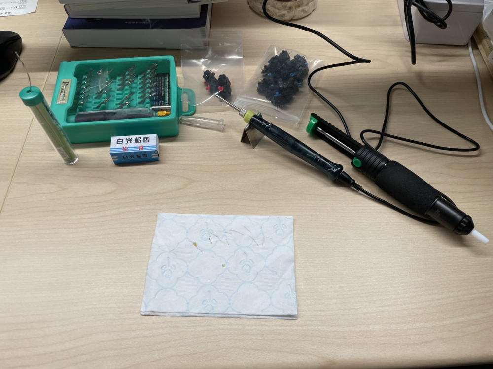
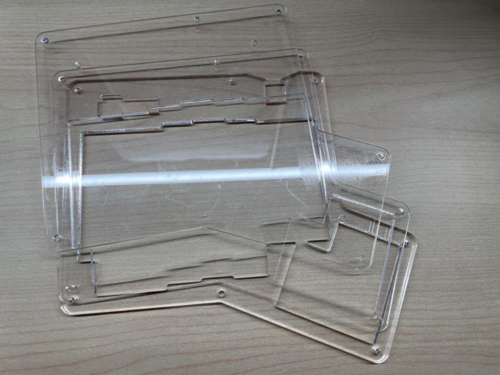
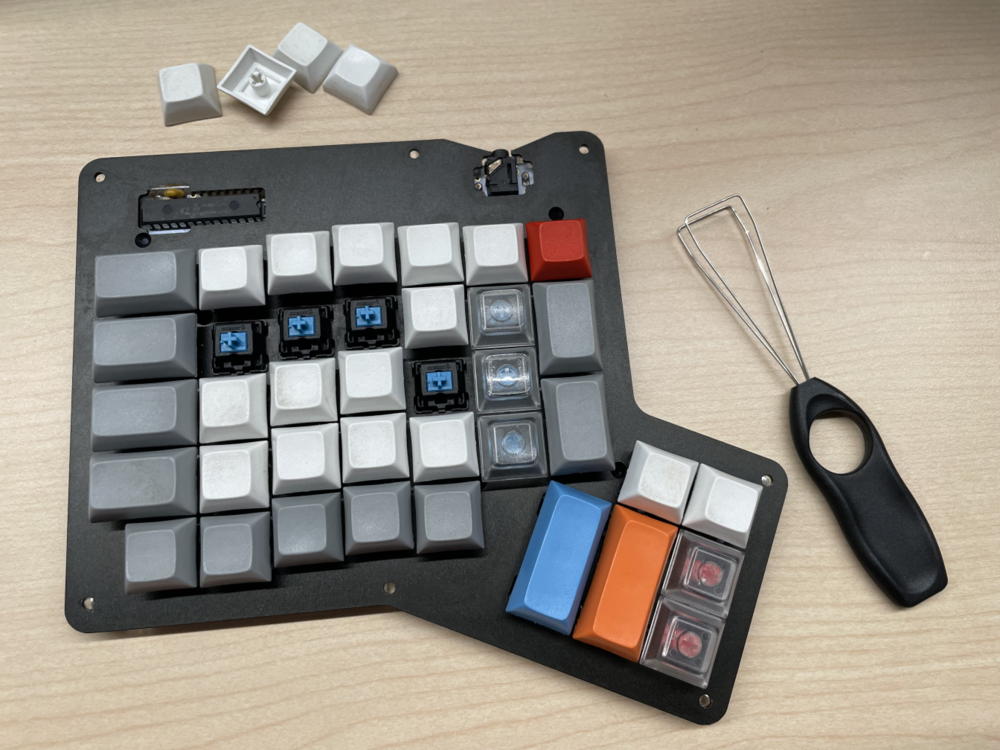
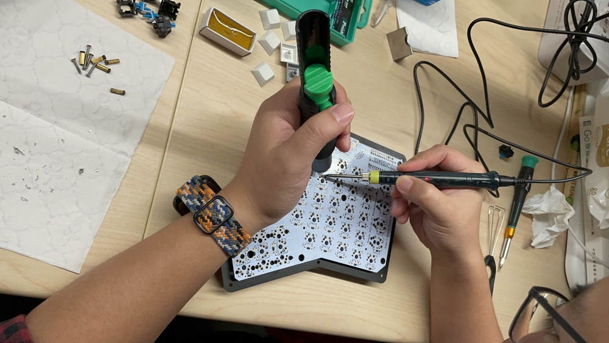
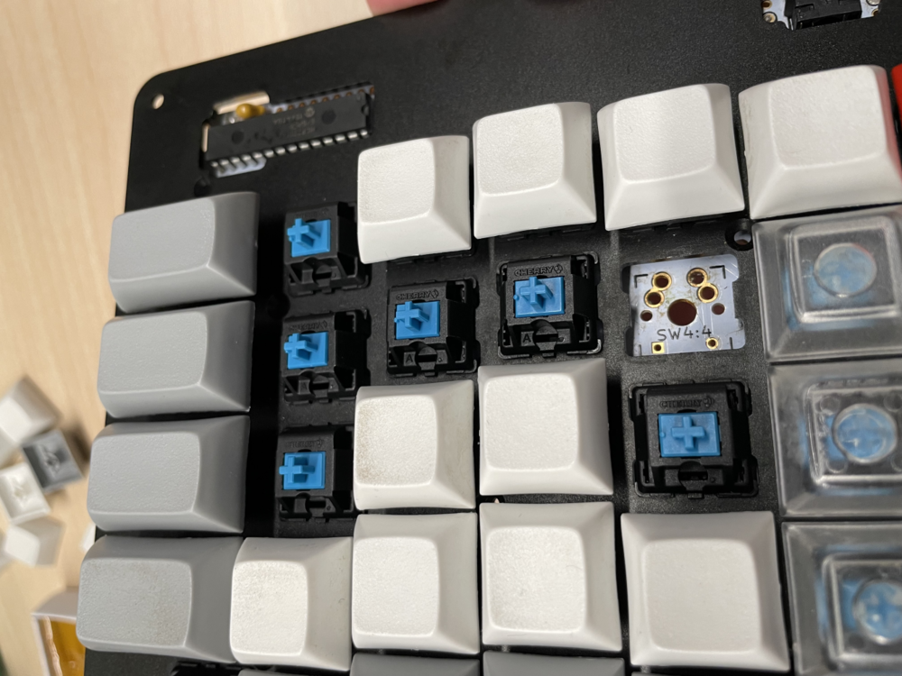
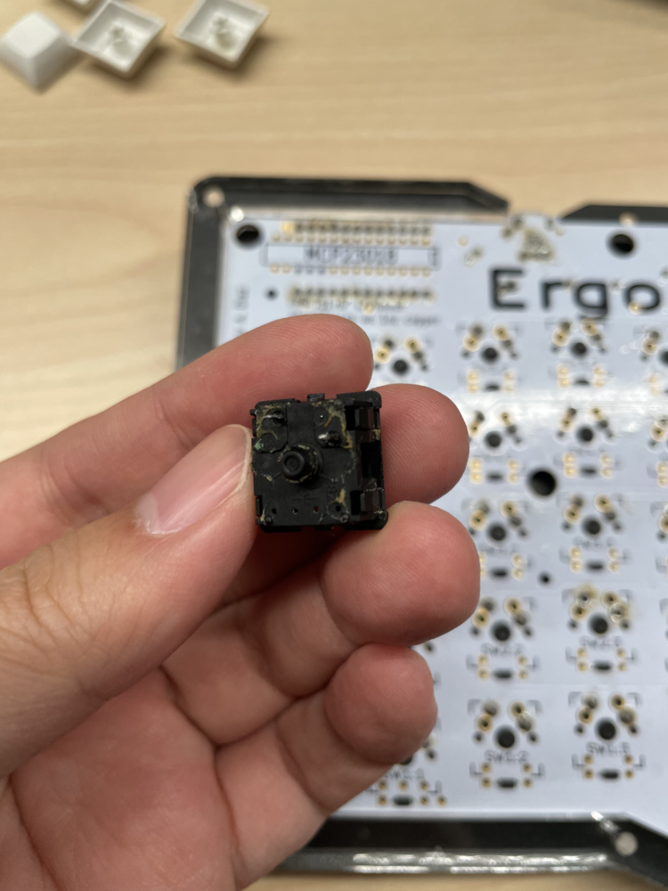
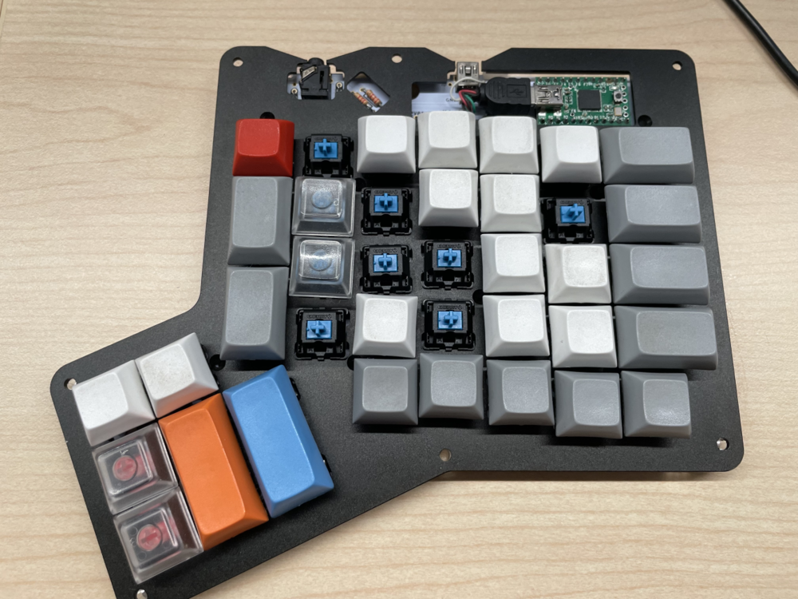
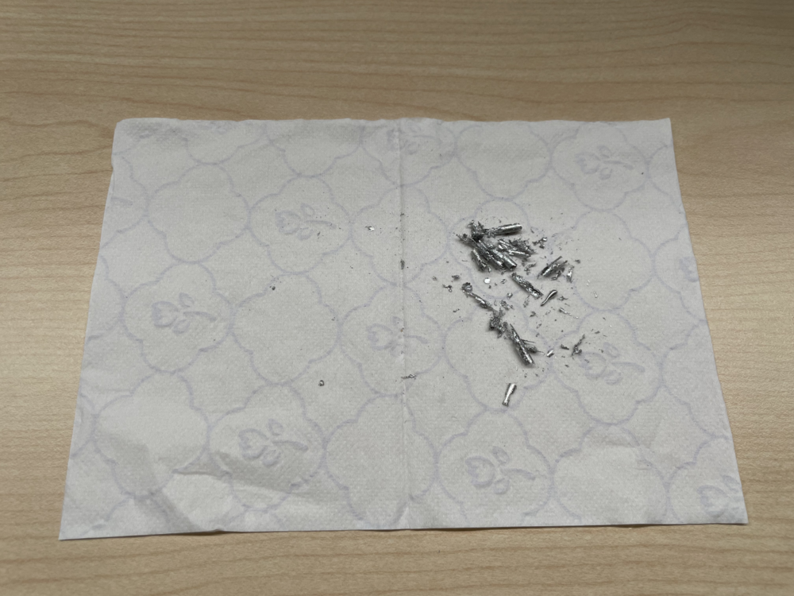
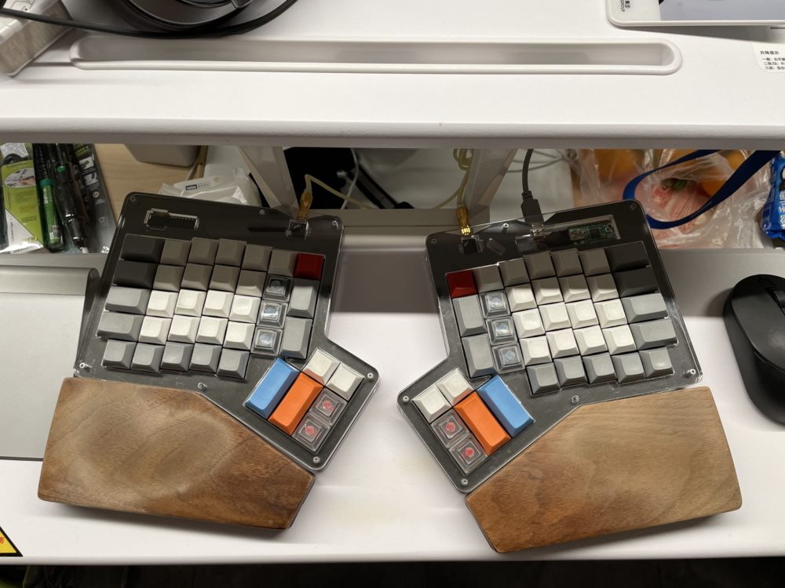

> In order to be well prepared, how can I successfully join an electronics factory after graduating at the age of 35?
>
> Learn from fixing keyboards(it's a joke)

## Background

The keyboard I using is the ErgoDox, an ergonomically split keyboard. More details about ErgoDox can be found in my previous [answer](https://www.zhihu.com/question/52088337/answer/141073759).

(former keycap color scheme + hand rest).

After seven or eight years of work, it has been into the water, into the coffee, but also into the soy milk, now finally a few keys are not flexible, pressed a sticky feeling, can not provide a smooth coding feel.

After a few months of using a back up Filco, I finally made up my mind to get the ErgoDox fixed.

## Prepare

- Soldering Iron
- Solder Sucker
- Solder
- Key Shaft
- Seiko Screw Driver Kit
- Key Puller
- Cherry Key Switch Puller

For those without soldering experience, you can learn how to soldering.

[女生都能学会的键盘焊接换轴教程\_哔哩哔哩\_bilibili](https://www.bilibili.com/video/BV1xt4y157LM/)

[电烙铁的错误和正确使用方法\_哔哩哔哩\_bilibili](https://www.bilibili.com/video/BV1Ui4y177kk/)

## Processing

<mark><b>Check which key shafts to replace, press one and listen to one</b></mark>

<mark><b>Remove the shell</b></mark>

<mark><b>Remove the corresponding keycaps (note that F J keycaps are different)</b></mark>

<mark><b>Melt the solder and suck the melted solder away with a solder sucker</b></mark>

<mark><b>With a key switch puller, remove it from the front, remember there is a soft clip, to up and down direction (i.e. cherry logo direction + opposite force)</b></mark>

<mark><b>Look at the coffee and soy milk that went in</b></mark>

<mark><b>Weld the new key shaft on</b></mark>

<mark><b>Sucking away the debris spit out the look of the solder sucker</b></mark>

<mark><b>Final assembly</b></mark>

## Summary

I have that feeling of typing smoothly again ~

Youthfulness is back~

Finally, I'd like to share my ErgoDox Layout configuration:

-   [alswl/ergodox-firmware/blob/master/src/keyboard/ergodox/layout/alswl-layout.c](https://link.zhihu.com/?target=https%3A//github.com/alswl/ergodox-firmware/blob/master/src/keyboard/ergodox/layout/alswl-layout.c) My layout configuration, Five layouts：Normal / Funtion Key / Number Pad / MediaKey / Arrow
-   [alswl/ergodox-firmware/blob/master/src/main.c#L127](https://link.zhihu.com/?target=https%3A//github.com/alswl/ergodox-firmware/blob/master/src/main.c%23L127) configuration for LED, lighting on to indicated the different layout
-   [alswl/teensy_loader_cli](https://link.zhihu.com/?target=https%3A//github.com/alswl/teensy_loader_cli)[alswl/teensy_loader_cli](https://link.zhihu.com/?target=https%3A//github.com/alswl/teensy_loader_cli) teensy loader cli works for macSO, the ofiicial binary not works when press the reset button

If you get something out of it, give it a like.
