I recently completed the switch from Toodledo to Obsidian Tasks (an Obsidian plugin), both of which are extremely
powerful time management tools. Although Toodledo was almost my favorite GTD software, the increasingly unstable service
has been bothering me. Coincidentally, Obsidian Tasks' ability to combine querying and knowledge base has produced a
1+1>2 effect. After trying it out, I decided to migrate to Obsidian Tasks.

Giving up an old friend like Toodledo, which I have been working with for more than a decade, made me feel a little sad,
but the process also prompted me to summarize my attempts at time management and share some of my experiences.


<small>Image frrom Pixelbay</small>

## What is GTD?

In this fast-paced modern life, we all encounter a large amount of tasks and information, and how to effectively manage
time and tasks has become a challenge for many people. During my school days, I also struggled with task management.
Starting from 2009, I tried to use tools such as [calendars](https://blog.alswl.com/2010/01/use-google-calendar-to-
manage-the-time/) and [notes](https://blog.alswl.com/2010/04/desktop-recording-tool-boogunote/) to organize my tasks and
information, but the effect was not ideal. It wasn't until later that I came across [DoIt.im](https://doit.im/) and
discovered David Allen's book, "Getting Things Done", which brought me a new approach to task management - GTD. For
decades since then, I have been using this method to manage my time.

GTD is a personal time management method created by David Allen, aimed at helping people manage their time and tasks
more effectively, thereby improving work efficiency and productivity. The basic idea of this method is <mark>to break
down all tasks into specific actionable steps and organize them in a reliable system for follow-up and management</
mark>. Through this method, people can more easily take control of their work and life, reduce stress and anxiety, and
thus complete tasks more efficiently with greater focus.

So how do we implement GTD? Here are the basic steps:

1.  Collect: Collect all tasks, ideas, plans, and to-do items, using various tools such as notebooks, mobile phones, and computers.
2.  Organize: Review the to-do tasks, classify all tasks and actionable steps, and review past unfinished projects.
    - Categorize: Review the collected tasks and categorize all tasks and actionable steps, commonly including projects, contexts, and time, to better understand the priority and relevance of the tasks. If the task can be completed quickly (<2m), do it immediately.
    - Review: Regularly review the tasks and actionable steps to ensure their progress and status are promptly followed up, to better control tasks and life, and thus complete tasks more efficiently.
3.  Execute: Focus on the current task, avoid distractions, and use time management and attention control techniques to improve efficiency.

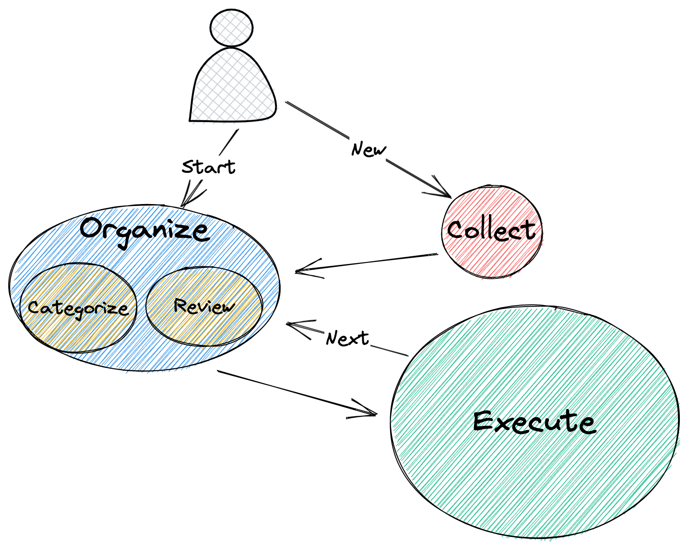

Note: There may be slight differences in structure and external tools I organized. <mark>I merged categorizing and
reviewing into the organizing step</mark> because I found that organizing is essentially planning, and planning involves
reviewing the collected to-do items as well as ongoing and completed projects. Why not do them together in the
organizing step?

## Online GTD Services I Have Used

I have used several online task management software, including Doit.im, Remember The Milk, OmniFocus and Toodledo. Below is my usage history and comparison of these software.

### Doit.im

I started with [Doit.im](http://doit.im/) when I first got into GTD. It is a domestic software that I really like. Doit.im supports basic GTD functions, provides clear task lists, classification, priority and other functions, as well as multiple review modes and multi-platform synchronization. However, I later gave it up because I found the more powerful Toodledo.


<small>Image from doit.im</small>

### Remember The Milk

When looking for the next management tool to use after Doit.im, I found [Remember The Milk](http://www.rememberthemilk.com/) (RTM). RTM provides basic task management functions such as adding tasks, setting reminders and archiving tasks etc., and supports multi-platform synchronization so you can use it on multiple devices such as computers or phones.

However some people may not like RTM's user interface design because it looks outdated compared to modern designs. In addition some advanced features require payment which was difficult for me at the time since I was still a poor student so I quickly stopped using RTM.

### Toodledo

I learned about [Toodledo](https://www.toodledo.com/) from [xbeta.info/gtd-toodledo.htm](https://xbeta.info/gtd-toodledo.htm) (a famous website where users share their experiences with different softwares). 

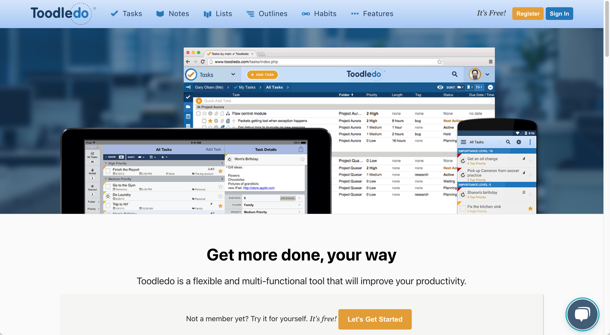

<small>Image from toodeldo.com</small>

Soon after that on [Productive Life]((http://www.productivelife.cn/)) ,  I found a very complete tutorial introducing advanced techniques in using Toodeldo especially how to use its Search module effectively . Unfortunately this website cannot be accessed anymore but we can get an idea of what Toodleo looked like back then through screenshots taken from other sources:

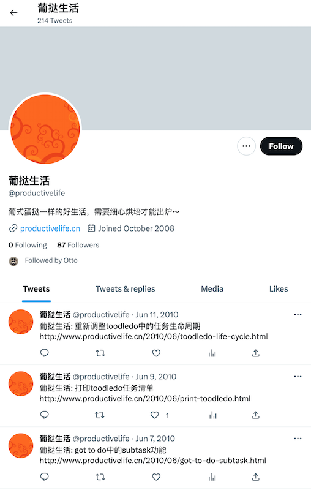

<small>Image frrom twitter.com/productivelife</small>

Toodleodo quickly became my favorite task management tool due to its comprehensive functionality supporting task classification sorting filtering etc., while also providing various review modes and custom fields. Additionally,Todoedo supports multi-platform synchronization along with a powerful API making integration with other applications easy.


### OmniFocus

Since Todoedo had slow access speeds without much improvement in product functionality over time,I briefly explored using[OmniFocus]((https://www.omnigroup.com/omnifocus/)), which is a professional Mac platform task management tool offering features such as project decomposition context etc.,and can be extended via AppleScript among others.OmniFocus supports multiple sync services including Omni Sync Server WebDAV FTP etc., allowing users to choose different services according to their needs.All data are stored locally so users can continue using the software even without internet connection.

After paying for it for some time,I realized <mark>that OmniFocu's search function could not compare with Todoedo's Search function </mark>,so it couldn't meet my needs.


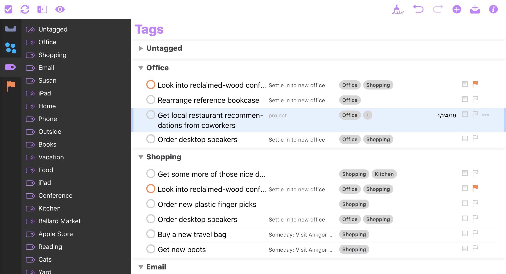

<small>Image frrom www.omnigroup.com/Omnifocus</small>


### Other Tools Tried Out

I have also tried out some other tools including Trello Asana Basement Tower Teambition etc.,
but since they were designed mainly for team collaboration rather than personal use,it wasn't convenient enough for me.Additionally,the customized search feature of these softwares (at that time) was often weak unable to meet my requirements.In the end,I returned back into the arms of Todoedo until now.


## How do I organize my daily tasks?

I think in the GTD system, the collection and processing stages are relatively mechanical and simple. The real test for
people is the **organization** stage:

-   Classification: how to quickly review all tasks and classify them;
-   Next step: how to determine the priority of the next task.

Below, I will share some of my personal concepts and operational methods.

### Classification means quick review

In order to better organize tasks, we need to pay attention to important attributes of tasks, including <mark>Context (environment), Project, Status, and Due</mark>. Context determines what needs to be done in the current environment and serves as a simple filter. I divide Context into Computer/Work/Mobile. Project assigns tasks to different projects with longer cycles and strong relevance among its tasks. Status describes whether a task can be processed immediately (Next) or requires waiting (Waiting). Some recurring tasks are labeled Active. Due describes time-related attributes such as On-time delivery (On), before this time (Due), or optional completion if possible.

Other attributes such as Priority and Folder type also need consideration but are not most important.

To better manage my daily workloads, every morning I open <mark>four views: single view, subtask view, project-xxx view,and inbox view.</mark>

-   **Single View** contains individual independent tasks that can be sorted by priority.
-   **Subtask View** shows parent-child relationships between larger goals broken down into smaller achievable steps.
-   **Project-x View** categorizes specific projects according to fixed templates consisting of several dozen related subtasks.
-   **Inbox View** is where newly collected items go through initial classification process.


### What's next?

The following filtering list helps identify which immediate actions should take place:

-  **Top**: High-priority task
-  Tasks due within three days that aren't recurring types require checking & preparation
-  Tasks due tomorrow require immediate action
-  High + Next: high-priority task with actionable conditions already met 
 - Timer isn't empty indicating it has started but may have been interrupted by other events 
 - Waiting indicates cooperation needed from others; progress check required 

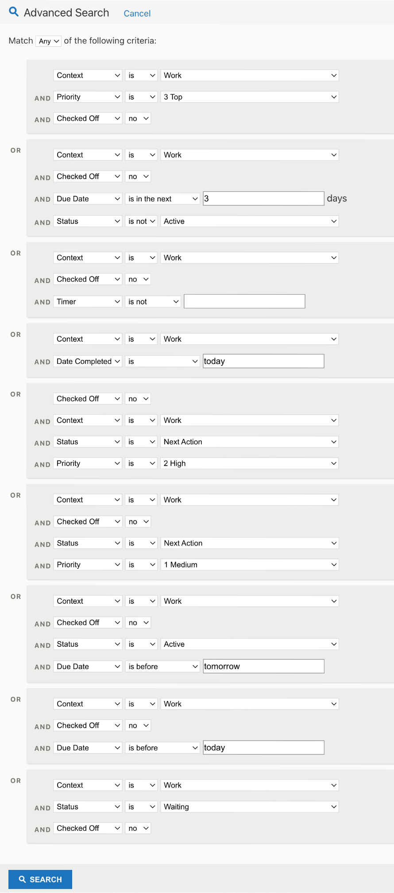

Tasks on this list are ranked based on their overall priority level combined with deadline dates & execution status considerations. Every time you enter work mode after reviewing your lists above just select top few items from this filtered list for execution.


## Former King - Toodledo

I've used it for over twelve years now paying eight years' subscription fees while its product philosophy deeply influenced my own strategies for managing time effectively.I'll introduce some features/details about Toodledo that worked quite well:

### Detailed Features

#### Recurring Task Functionality

Toodledo supports recurring task functionality allowing users set up repeating periods like daily / weekly / monthly etc., so when a completed item reappears automatically in your active list ready for further processing.This feature helps users manage routine activities more efficiently like regular meetings,daily email handling,daily reviews etc..

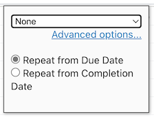

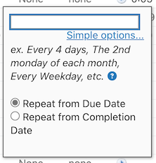


#### Rich Time Function Types

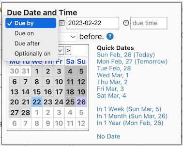


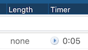


#### Search Function

Search function provided by Toodledo is very powerful supporting complex logical queries(offers conditional combinations
of AND/OR searches).Users could search based on multiple criteria including name,label,date,priority etc..This feature
helps users organize their workload more efficiently.I was highly dependent upon this feature during organization phase
hence couldn't leave Toodledo at one point.

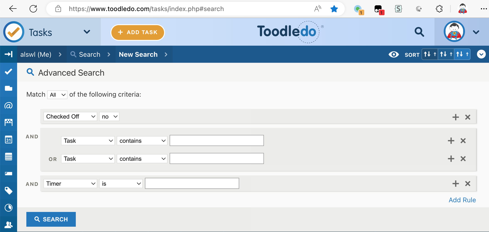


### Tools and Plugins I Developed

Overall, I would still recommend Toodledo to everyone. I have developed multiple tools and plugins based on the API provided by Toodledo. Let me introduce them to you:

#### Buff 1: Elegant Subscription of Toodledo Calendar

Toodledo provides calendar subscription capability that displays tasks in various calendar software. However, the original information is very messy, does not consider task time, and also calculates time incorrectly. Therefore, I developed a web service called [toodledo_calendar_filter](https://github.com/alswl/toodledo_calendar_filter).

It can display Toodledo's tasks more friendly on the calendar system. Specifically, it can filter [Toodledo's iCal](https://www.toodledo.com/info/help_ical.php) and only display tasks with due dates and durations. If you also have similar needs, you can use my online service directly (https://toodledo-calendar-filter.alswl.com).

Before:

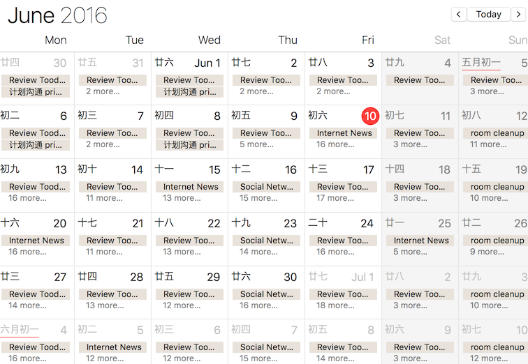

After:

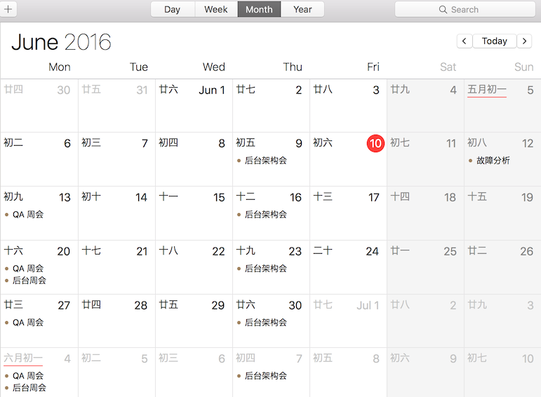

#### Buff 2: Make Toodeldo Have Gmail Shortcut Keys

When using Toodeldo for task management, do you feel that the operation is cumbersome and mouse efficiency is low? Do you miss Gmail-style shortcut keys? If so, then my project [alswl/my-toodleodo] (https://github.com/alswl/my-toodleodo) can help solve this problem.

It is a Greasemonkey script for Toodleodo that provides a series of Gmail-style shortcut keys so that you can quickly operate like using Gmail in Toodleodo including moving tasks (`j` / `k`), task operations (`x` marks completion , `enter` starts the task), switching task views (`g s` jumps to search), etc.. It runs stably on Chrome/Safari/Firefox browsers; if you want to improve your efficiency when using Toodeldo，you may try it out.

#### Buff 3: Command Line Tool go-toodeldo

In order to quickly collect tasks，I once used a CLI tool ([wsargent/toodeldo] (https://github.com/wsargent/toodeldo)) on Github。However，it was based on version 1 of API which has been announced by official seven or eight years ago will be offline soon。So I made my own small project called [go-toodeldo ](https://github.com/alswl/go-toodeldo).

At first，go-toodeoldo only provided basic CLI functions。Later，I gradually added complete SDK、CLI full functionality even an interactive <mark>TUI application</mark> allowing users to conveniently use Toodeoldo in Terminal。

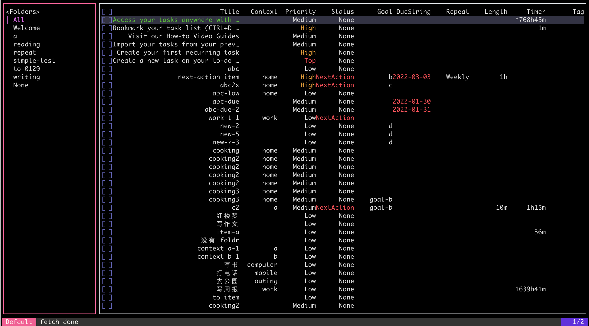

Toodeoldo does not provide OpenAPI interface officially；I generated a reverse-engineered copy of [go-TOODEOLDO/swagger.yaml] (Https：// github .com / alswl / go-TOODEOLDO/blob/master/api/swagger.yaml)，if anyone else has development requirements for TOODEOLDO API ，they could directly use this API。

### Leaving

Recently，I have become increasingly disappointed with the stability of Toodeldo -the task management service I've been using all along。
They[changed their new service provider]（Https：// blog .tooleldo .com/hello-from-the-new-Tooleldo-team/)，
and there are more frequent occurrences of unstable services while new team’s product capabilities also raise some questions.
Therefore,I decided to start looking for better task management services。
Because Kindle stopping its services in China event makes me doubt about cloud services' reliability。
Therefore,I started looking for some<mark>localized solutions</mark>that could be serviced through network disks(such as iCloud),
so as to better protect my data privacy.


## Final Winner - Obsidian Tasks

[Obsidian](https://obsidian.md/) is a personal knowledge management (KMS) and note-taking application based on local files, which helps users organize, link and analyze their notes and ideas. It is a purely local software that can be synchronized across multiple devices using methods such as network disks/NAS.

[Obsidian Tasks](https://github.com/obsidian-tasks-group/obsidian-tasks) is a powerful Obsidian plugin that allows you to easily manage tasks and to-do items in Obsidian. This plugin can add tasks to your notes through simple syntax, automatically mark the status of tasks according to their completion status. You can use Obsidian Tasks to track personal tasks, work tasks, study tasks, etc. In addition, it also has some other features such as custom task styles, creating filters to find tasks, and automatically moving tasks based on their status. Obsidian + Obsidian Tasks are a perfect combination that can help you better manage your to-do list and improve your productivity.

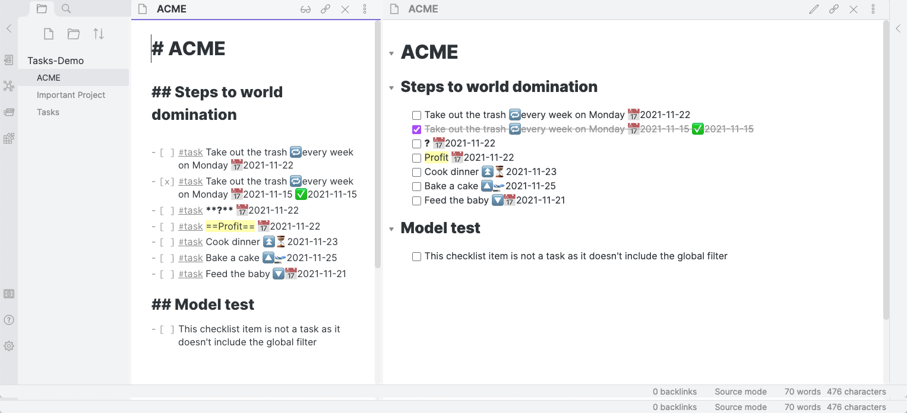

<small>Image from https://github.com/obsidian-tasks-group/obsidia</small>

My personal KMS has been fully migrated from [Notion] (http://notion.com/)to Obisidan with low migration costs using Obisidan Tasks. After learning about Obsidain Task for some time,I have smoothly transferred my previous usage patterns of "organizing"and "next task"to Obisidan Task.I will continue introducing how I efficiently use Obisidan Task in these two scenarios.

I organize my pending task in the following ways:

- Ordinary document task marked with `[ ]`, usually small scattered ones.
- Special documents ending with `.todo.md` for overall project coordination.
- Documents tagged with `#todo`, usually big issues where I split out several `Tasks` at the top after splitting off the `TODO` queue tag.

Based on this organizational structure,I easily handle these two scenarios: **organizing**and **next task**:

### Classification means quick review

Use several views<mark>to present the recorded tasks in multiple views</mark>, including:

- Today's perspective
    - non-repeated: one-time task，often more important
    - repeat：repetitive task，such as weekly meetings or appointments，often transactional
- Time perspective
    - Upcoming expiration date（within 7 days）
- Single Tasks：tasks scattered throughout daily affairs without being included in files ending with `.todo`
- Project：tasks arranged by project 
- Tagged with `#todo`, often requiring processing of an entire document 

These views allow you to classify your tasks better and quickly review them.By using these views,you can better manage your pending items,and improve your productivity.

This is my projects / View.todo.md`:

````markdown
## Today

**WIP**
```tasks
status.type is IN_PROGRESS
```

**High（Planning）**
```tasks
not done
priority is above medium
```

**None repetead due today**
```tasks
((not done) AND (due before in 1 day)) OR (done on today)
is not recurring
sort by priority
```
**Repeated due today**
```tasks
((not done) AND (due before in 1 day)) OR (done on today)
is recurring
sort by priority
```

**Over due before today**
```tasks
not done
due before today
sort by priority
```

**Today complete**

```tasks
done
done on today
```


## Future (no repeat)

**in 1 day**

```tasks
not done
due before in 1 day
is not recurring
sort by priority
sort by due
```


**in 3 day**

```tasks
not done
due after in 1 day
due before in 3 day
is not recurring
sort by priority
sort by due
```

**in 7 day**

```tasks
not done
due after in 3 day
due before in 7 day
is not recurring
sort by priority
sort by due
```


## Singles Tasks

**in 7d（non project x no repeate）**

```tasks
not done
status.type is not CANCELLED
NOT (path includes .index)
NOT (path includes .todo)
NOT (path includes .notodo)
due after in 7 days
sort by priority, due
```

**none project x no due x no repeat**

```tasks
not done
status.type is not CANCELLED
NOT (path includes .index)
NOT (path includes .todo)
NOT (path includes .notodo)
no due date
sort by priority, due
```


## Projects

TODO

## Help

> [Queries Syntax](https://obsidian-tasks-group.github.io/obsidian-tasks/queries/)


````

### What is the next task?

In Obsidian's [Daily Note](https://help.obsidian.md/Plugins/Daily+notes) plugin, set the template to `_templates/daily` so that you can have a daily to-do list that you can use anytime.

This is my Daily setup, divided into four sections: Today's due single tasks / Today's due repeating tasks (transactional and unimportant) / Today's completed tasks / Today's new tasks (usually Single).

This is my `_template/daily.md` file:


````markdown
## TODO

**WIP**
```tasks
status.type is IN_PROGRESS
```

**New tasks**


**Tasks view - today**
```tasks
((not done) AND (due before {{date}})) OR ((not done) AND (due on {{date}})) OR (done on {{date}})
is not recurring
sort by priority, due
```

**Tasks view - today(repeated)**
```tasks
((not done) AND (due before {{date}})) OR ((not done) AND (due on {{date}})) OR (done on {{date}})
is recurring
sort by priority, due
```

**Over due date**
```tasks
not done
due before {{date}}
sort by priority, due
```

**Projects**

YOURS


**Tasks view - today done**
```tasks
done
done on {{date}}
```

````

### What are the drawbacks of Obsidian Tasks?

Firstly, it should be noted that Obsidian Tasks is a plugin for Obsidian. If you have not used Obsidian before, it may take some time to get familiar with it. However, if you are already using Obsidian, the bidirectional linking feature of Obsidian Tasks will provide excellent support for GTD scenarios, which is both an advantage and a disadvantage.

Secondly, at present, Obsidian Tasks does not offer timer functionality. However, personally speaking, this is no longer important to me. With age and over ten years of GTD training under my belt, I no longer need tools to maintain focus. When working I am quite focused and do not get distracted frequently.

Finally, it should be noted that there are issues with Obsidian itself. As a tool based on local files only without online tools (although there are other cloud-based solutions), if you want an online service accessible from both your computer and phone then perhaps Obsidian Tasks may not be suitable for you. For me personally though I use iCloud storage as part of Apple's ecosystem so all my data is stored in iCloud Drive; I use the macOS application and iOS version of [Obsidian](https://obsdian.md/download) which allows me to easily use the same Vault (i.e., knowledge base) between my MacBook and iPhone. Before launching either app though I make sure that syncing has completed first.

## Conclusion

Time management is an unavoidable topic for modern workers but also one we often struggle with too. The methodology behind GTD provides us with an easy yet efficient way to manage our workloads allowing us <mark>to quickly end procrastination or distraction states</mark>and fully immerse ourselves in our work.

Tools are important but they cannot solve all problems alone; when managing time effectively what matters most is being clear about <mark>what your goals actually are</mark>. When you have a clear mission in mind it will constantly float around in your head meaning even without GTD tools managing things becomes easier.

I hope this article introducing the GTD method can help bring benefits into your work life allowing you to complete tasks more efficiently while still enjoying life's beauty too! Remember: time is limited so cherish every minute; seize every opportunity making your own life more wonderful!
