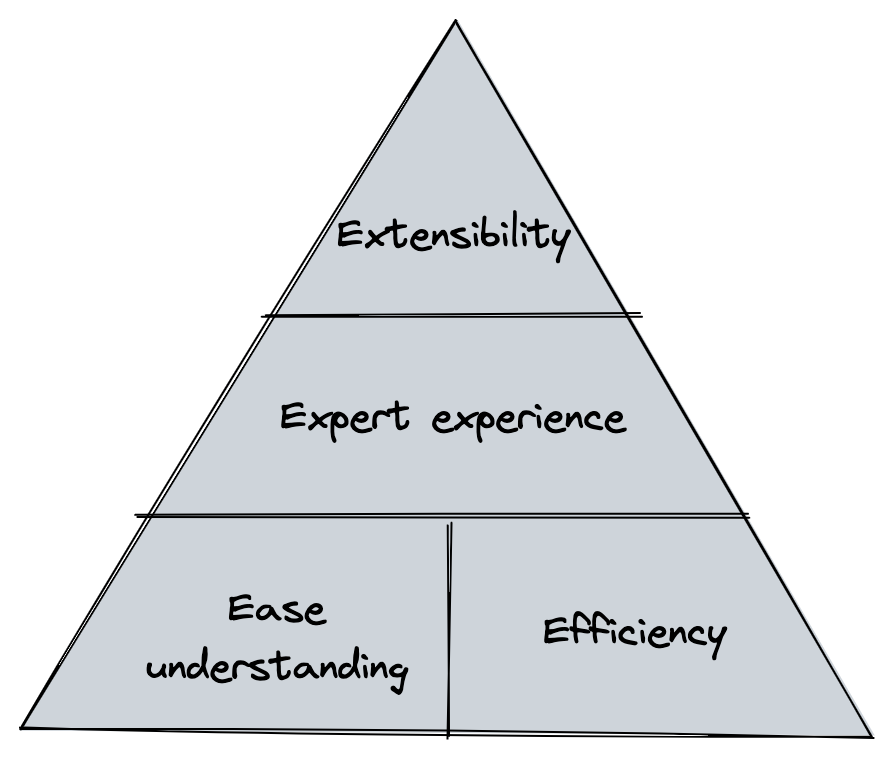
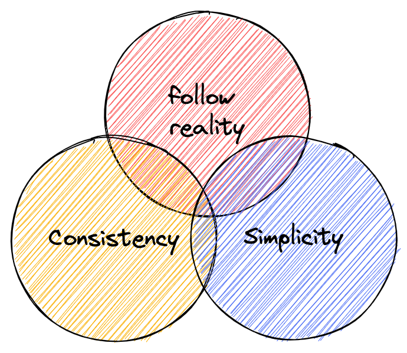
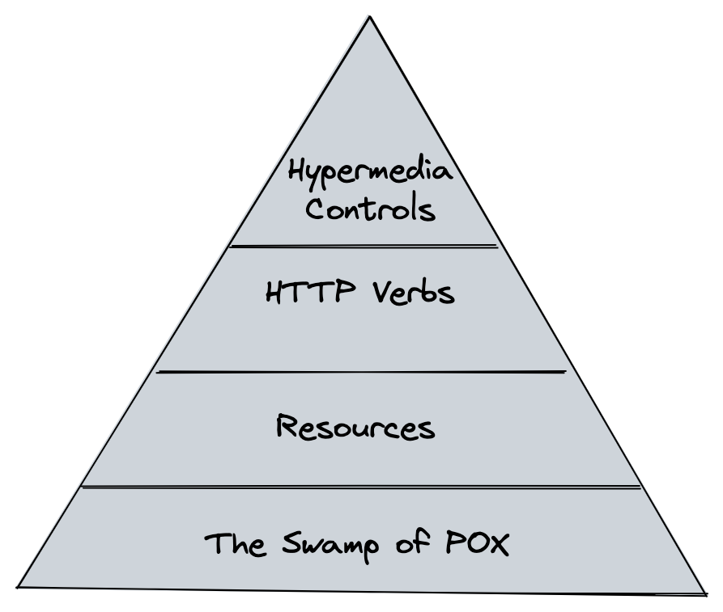
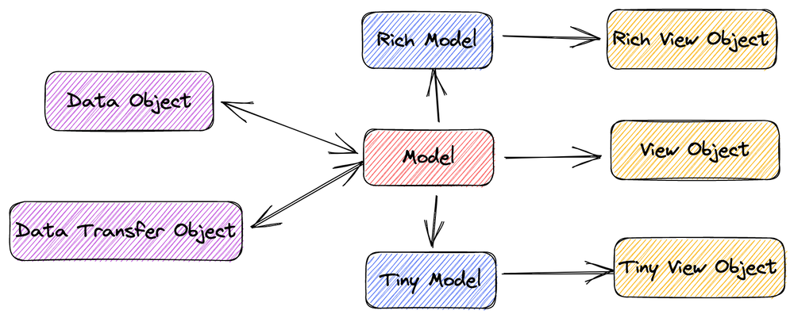
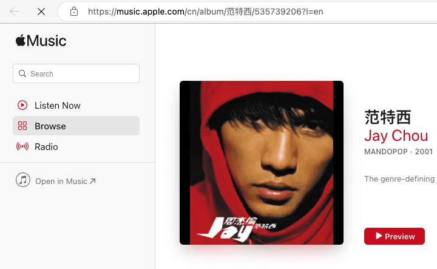

When starting to create a new system, or participating in a new team or project, there is a simple but profound question: Is there a design specification for the API of this system (Web Server)?


<small>image by stable difussion, prompt by alswl</small>

This issue has bothered me for a long time, starting during my school days, and every time I needed to communicate and discuss with my team members.
From the initial free style to the later REST, I often referenced [Github v3](https://docs.github.com/en/rest?apiVersion=2022-11-28) to the project team and the
Foursqure API (no longer accessible, exposing age) documentation.
However, in practice, there are still cases where there is a mismatch with the actual work or the common company specification.
This is when I need to do some additional work. Eventually, I will write a brief `DEVELOPMENT.md` document to describe the design solution.

But I've always had more ideas for that document, and it's not quite good enough. So, I wanted to put together a <mark>Simple and Pragmatic</mark> Web API best practice, which is this article.


## Why We Need API Uniformity Specifications

The problem seems obvious, but a deeper analysis involves teamwork efficiency and engineering design philosophy.

API (Application Programming Interface) is the bridge between different software systems to interact with each other. When communicating between different software systems, the
APIs allow data transfer and processing in a standardized way, enabling the integration of various applications.

When we start writing API documentation, a paradigm (Design Pattern) emerges, whether it is explicit or implicit, whether
Whether it is one set for each or a common set. This is just like when we use a unified USB interface, unification reduces costs and avoids possible errors. Specifically, there are several reasons for this:

- Ease of understanding and efficiency: service providers and consumers use a unified form, structure and usage, and a unified production-consumption protocol, thus reducing communication costs.
- Expert experience: It contains best engineering practices with corresponding solutions for common scenarios, avoiding the need for everyone to rethink the entire API system.
  For example, how do you handle API caching? How to perform authentication? How to handle data formatting?
- Extensibility: extensibility require stable protocols, protocols are abstract and implementation-independent, and not everyone has them
  The ability to design uncertainty-oriented systems, and some widely used technologies plan for a wider range of scenarios.



<small>image by alswl</small>

While it is true that there are some costs associated with the use of a unified specification that requires framework understanding and promotion, I believe that in most scenarios
the benefits of a unified specification far outweigh these costs.

However, not all cases require consideration of the API specification. For short lifecycle projects, internal projects and products with a very small impact
specifications may not require much attention. In addition, in some special business scenarios, the
The underlying protocol may change, and the existing specification may no longer be applicable. But even so, I still recommend redrafting a new specification, rather than abandoning it.


## Principles of rules

When developing API specifications, we should follow some basic principles to deal with technical differences, and I have summarized three principles that have gained wide acceptance:

- Simplicity: Simplicity is the most direct and effective strategy to resist complexity, using the principle of simplicity to reduce complexity and avoid the breeding and proliferation of complexity;
- Consistency: uniform design patterns and continuity of design styles help reduce engineering costs and the psychological burden on engineers;
- follow reality: follow the abstractions and layering of existing engineering domains (e.g. HTTP, REST, RBAC, OIDC, etc.) and do not invent new concepts of your own.
    Always think about whether the problem is the only one you have encountered (the answer is definitely no).




<small>image by alswl</small>


## Does REST work or not?

The [RESTful API](https://en.wikipedia.org/wiki/Representational_state_transfer) has become a popular protocol in the Web API space.
Its broad applicability and reach stems from its binding to the HTTP protocol, which allows RESTful APIs to easily interact with existing Web technologies. If you are not familiar with REST, you can check out [Yifeng Ruan's
You can check out [Yifeng Ruan's RESTful API Design Guide](https://www.ruanyifeng.com/blog/2014/05/restful_api.html) and
[Best Practices for RESTful API Design](https://www.oschina.net/translate/best-practices-for-a-pragmatic-restful-api?print).

REST is a high maturity protocol, which [Leonard Richardson](https://martinfowler.com/articles/richardsonMaturityModel.html#level0)
describes it as having four levels of maturity:



<small>image by alswl</small>

1. The Swamp of POX, using HTTP to host the Legacy protocol (XML)
2. Resources: using resource abstraction
3. HTTP Verbs: using rich HTTP Verbs
4. Hypermedia Controls: API resource integration using `rel` links, [JSON:API](https://jsonapi.org/) is the pinnacle of performance

The core strength of REST is that

- It takes full advantage of the design of the HTTP Protocol (HTTP Protocol)
- It has excellent identification of resources
- It is designed with complete manipulation of resources (Manipulation of resources)
- It has Self-descriptive messages
- It supports multiple forms of presentation (hypermedia as the engine of application state)

However, <mark>REST is not a specific protocol or specification, but a style philosophy</mark>. While REST defines rules and principles such as the identification of resources, unified interfaces, stateless communication, etc., it does not prescribe a specific protocol or specification.
it does not prescribe a specific way to implement them. As a result, in practice, different teams may have different understandings and practices, leading to inconsistencies and portability of the API.
This leads to inconsistency and reduced maintainability of the API.

In addition, REST has a number of limitations and drawbacks:

- Not all requests can be described by resources, such as the login (`/login`) operation, which is very convoluted when converted to `session`;
    The same problem arises for operations like money transfers, where the limited number of HTTP verbs cannot support all business scenarios.
- REST does not provide a clear solution to the inevitable problems such as paging, specific structure of the return body, error handling and authentication, etc.
- For complex queries (such as Search Search), the query parameters of the RESTful API can become very complex and difficult to maintain.

Therefore, although the REST style is a good guideline, the specific implementation needs to be combined with specific business requirements and technical features to make some trade-offs in order to achieve a good API design.
Finally, do we need a Web API design specification that follows the REST style? I think REST can solve 90% of the problems, but there is still 10% need to specify the details.


## Web API specification multiple choice questions

Since our protocol is based on HTTP and REST design, we will base our discussion on the four core parts of an HTTP request: URL, Header, Request and Response.
These are: URL, Header, Request and Response.


### URL Best Practices

My inspiration for URL design came from [Ruby on Rails](https://guides.rubyonrails.org/routing.html).
Before that, I always instinctively put model information on top of URLs, but in reality good URL design should be a plan for the information structure of the system.
Therefore, URL design should consider not only the API, but also the user-oriented Web URL.

To achieve good URL design, I have summarized the following rules:

- Locate resources (this answers the question of whether paging should be in the Header)
- Self-explanatory (readable, the URL itself contains the core information)
- Security (can not contain user authentication information, OAuth spent a lot of effort to understand this, anti-forgery)

Typically, the URL model is as follows:

`/$(prefix)/$(module)/$(model)/$(sub-model)/$(verb)?$(query)#${fragment}`

where Prefix may be the version of the API, or it may be a special qualification, as some companies rely on for access layer triage;
Module is a business module, which can also be omitted; Model is a model; SubModel is a submodel, which can be omitted;
Verb is a verb, which can also be omitted; Query is a request parameter; Fragment is an HTTP primitive Fragment.

It is important to note that not all components are required to appear. For example, fields such as SubModel and Verb can
be allowed to be hidden in different URL styles.

**Design Style Options**

Note: **Please note that there is no association between Scenario A / B / C and no association above or below each line**


| Problem                                                                                   | Explanation (see separate analysis below)    | Option A             | Option B             | Option C                                                |
| ---                                                                                       | ---                                          | ---                  | ---                  | ---                                                     |
| Dos API path's prefix                                                                     |                                              | `/apis`              | `/api`               | second-level domain                                     |
| Does the path contain the API version                                                     | **Version advantage in URLs**                | ✅                   | 🚫                   |                                                         |
| Does path contain a group                                                                 |                                              | ✅                   | 🚫                   |                                                         |
| Whether path contains action                                                              | **HTTP Verb is not enough**                  | ✅                   | 🚫 (pure REST)       | Depends (include if HTTP Verb CRUD cannot be satisfied) |
| Model ID form                                                                             | **Readable Stable Identity explained**       | Self-incrementing ID | GUID                 | <mark>Readable Stable ID</mark>                         |
| Model singular or plural in URL                                                           |                                              | Singular             | Plural               | List Plural, One-Way Singular                           |
| Is the resource one-level (tiled) or multi-level (nested)                                 | **Explanation of one-level and multi-level** | One-level (tiled)    | Multi-level (nested) |                                                         |
| How is search implemented, standalone API (`/models/search`) or list-based `/models/` API |                                              | standalone           | list-based           |                                                         |
| Does it have an Alias URL                                                                 | **Alias URL explanation**                    | ✅                   | 🚫                   |                                                         |
| Does the model in the URL allow abbreviations (or refinements)                            | **Model abbreviations explained**            | ✅                   | 🚫                   |                                                         |
| Hyphenation of multiple words of the model in the URL                                     |                                              | `-`                  | `_`                  | Camel                                                   |
| Whether to distinguish between Web API and Open API (non-browser oriented)                |                                              | ✅                   | 🚫                   |                                                         |

**Version advantage in URLs**

We follow the principle of consistency when designing URLs; the same URL is used to access the same resource, regardless of identity or state.
This is also the basic principle of Uniform Resource Location. While we can accept different content formats (e.g. JSON / YAML / HTML / PDF / etc.)
but we want the location of the resource to be unique.

However, the question is, should the same resource be reflected in the URL for rendering between versions? This depends on whether the designer considers versioning to be in the realm of location information.

According to the RFC design, in addition to the URL there is [URN (Uniform Resource Name)](https://en.wikipedia.org/wiki/Uniform_Resource_Name).
The latter is used to identify the resource, while the URL points to the resource address. In practice, URNs are not so widely used that URIs are almost equivalent to URLs.

**HTTP Verb is not enough**

In REST design, we need to operate on resources using HTTP verbs like GET / POST / PUT / DELETE / PATCH / HEAD.
For example, using the API `GET /apis/books` to view book listings is natural and reasonable.
However, when it comes to performing an action like "borrow a book
we don't have a suitable verb (BORROW) to represent it. In this case, there are two possible options:

1. use the POST method with a custom verb, such as `POST /apis/books/borrow`, for the action of borrowing a book;
2. creating a book borrow log, using a resource add method to structure the non-existent action, e.g. `POST /apis/books/borrow-log/`;

This issue comes up a lot in complex scenarios such as user login (`POST /api/auth/login` vs `POST /api/session`) and account transfers (vs transfer record creation), etc.
<mark>API abstract or concrete, there is always an explanation of the business. </mark> We can't simply generalize all of our business to CRUD.
Rather, we need to divide the business wisely to make it clearer and more understandable to users.

When designing, we can consider whether we need to create a corresponding button for each API to make it easier for users to do so.
If there is only one API named `/api/do` and all the services are bound to it, although technically possible, this design does not meet the business requirements.
Each layer of abstraction is designed to standardize the solution to a particular problem, and the TCP L7 design is a reflection of this philosophy.


**Readable Stable Identity explained**

When marking a resource, we typically have several options:

- Use ID: IDs are usually bound to database self-incrementing IDs.
- Use a GUID: such as a UUID, although less precise.
- Use Readable Stable Identity: Usually identified by name, UID, or a specific ID such as a host name, IP address, or serial number.
  This identifier is required to be stable and globally unique, which is useful in internal systems.

I have a personal design tip: use a slug of the form `${type}/${type-id}` to describe an identifier.
For example `hostname/abc.sqa` or `ip/172.133.2.1`.
This design approach provides a good balance between readability and uniqueness.

> A slug is a human-readable, unique identifier, used to identify a resource instead of a less human-readable identifier like an id .

from [What's a slug. and why would I use one? | by Dave Sag](https://itnext.io/whats-a-slug-f7e74b6c23e0)


PS: At the end of the article I'll also introduce an Apple Music solution that combines the ID / Readable / Stable features.

**Explanation of one-level and multi-level**

The hierarchical design of URLs can be based on modeling, or a straightforward single-level structure can be used. specific problem solving approach.
For example, when designing user-owned books, one can choose a multi-level structure `/api/users/foo/books` or a one-level structure `/api/books?owner=foo`.

Both options are technically possible, <mark>the former respecting the attribution of the model, and the latter focusing on the simplicity of the URL structure</mark>.

A multi-level structure is more intuitive, but also needs to address the issue of possible multiple ways of organization, such as books in a library organized by author or category?
In this case, consider making the attribution of models explicit in a multi-level structure
For example `/api/author/foo/books` (based on authors) or `/api/category/computer/books` (based on categories).


**Alias URL explanation**

For some frequently used URLs, although they can be designed according to URL rules, we can still design a more concise URL that
to facilitate user presentation and use. This design is especially common for Web URLs. For example, the API for a library's most popular books:

```
# Original URL
https://test.com/apis/v3/books?sort=hot&limit=10

# Alias URL
https://test.com/apis/v3/books/hot
```

**Model abbreviations explained**

Often, when modeling resources, longer names are used to name them, for example a book index might be named `BookIndex` instead of `Index`.
When rendering in URLs, since the URL prefix of `/book/book-index` contains Book, we can reduce the layer of description and
We can make the URL more concise, for example by using `/book/index`. This technique is very common in Web URL design.

There is also a strategy of model abbreviation, which provides a complete set of alias registration schemes. aliases that are globally unique.
For example, in Kubernetes, [Deployment](https://kubernetes.io/docs/reference/generated/kubernetes-api/v1.26/#deployment-v1-apps)
is a common naming, while `apps/v1/Deployment` is the full name by adding a Group restriction.
There is also a shorthand for `deploy`. This mechanism relies on Kubernetes' API Schema system for registration and work.

### Header Best Practices

We often overlook the importance of the Header. In fact, the selection of HTTP verbs, HTTP status codes, and various authentication logic (e.g., cookies / Basic Auth / Berear Token) all depend on the design of the Header.
In fact, the selection of HTTP verbs, HTTP status codes, and various identity verification logic (e.g., Cookie / Basic Auth / Berear Token) all depend on the design of the Header.


**Design style selection**

| Problem                             | Explanation (see separate analysis below) | Option A                     | Option B                                 | Option C     |
| ---                                 | ---                                       | ---                          | ---                                      | ---          |
| Are all verbs using POST            | **About only using POST**                  | ✅                           | 🚫                                       |              |
| Is the Modify action POST or PATCH? |                                           | POST                         | PATCH                                    |              |
| HTTP status return code             | **2XX family**                            | Make full use of HTTP Status | Use only core status (200 404 302, etc.) | Use only 200 |
| Is using rate limiter system        |                                           | ✅ 429                       | 🚫                                       |              |
| Is using cache system               |                                           | ✅  ETag / Last Modify       | 🚫                                       |              |
| Is validate UserAgent               |                                           | ✅                           | 🚫                                       |              |
| Is validate  Referrral              |                                           | ✅                           | 🚫                                       |              |


**About only using POST**

Some novices (or those who consider themselves experienced) may come to the erroneous conclusion that, with the exception of GET requests
all HTTP requests should use the POST method. Some even demand that [all actions (even read-only requests) should use the POST method](https://www.zhihu.com/question/336797348).
This argument is often supported on the grounds of "simple consistency", "cache avoidance", or "operator requirements".

However, it is important to understand the original design of the HTTP method: it is used to describe the type of resource manipulation that gives rise to a number of issues including caching, security, and idempotency.
In relatively simple scenarios, omitting this layer of abstraction really doesn't pose much of a problem, but once you get into the complexities of the domain, the
Using this layer of abstraction for HTTP methods becomes very important. <mark>Whether this follows the standard or not will determine whether you get the benefits of standardization</mark>.
The analogy is like a new phone manufacturer that can choose not to use the USB TypeC interface.
It's technically possible, but it also loses a lot of standardization support and mental agreement.

I especially like one [Knowing user](https://www.zhihu.com/people/huixiong-19)'s
[comment](https://www.zhihu.com/question/336797348/answer/2198634068): "<mark>Routing hasn't gone away, it's just shifted</mark>.

**2XX family**

The purpose of HTTP status codes is to indicate the result of communication between the client and the server. 2XX status code family means that the server has successfully received, understood, and processed the client request,
understood and processed the client request, and the response was successful. The following are common status codes in the 2XX family and their meanings:

- 200 OK: The request was processed successfully and the server returned a response.
- 201 Created: The request has been successfully processed and a new resource has been created on the server.
- 202 Accepted: The request has been accepted by the server, but not yet executed. This status code is typically used for asynchronous processing.
- 204 No Content: The request was processed successfully, but the server did not return any response body content.

The 2XX family of status codes indicates that the request has been successfully processed. These status codes let the client know explicitly that the request has been processed correctly so that it can proceed to the next step.

The need to use the 2XX family of status codes across the board depends on whether the client needs to be explicitly/displayed with information that
inform it of the next action. If it has been clearly described by other means (including documentation, verbal agreements)
then it is indeed possible to use 200 status codes across the board for return. But passing meaning based on behavior.
or document-based (or even verbal)? Is it more complex or more concise?


### Request Best Practices


**Design style selection**

| Problem                                                                     | Explanation (see separate analysis below) | Option A    | Option B     | Option C           |
| ---                                                                         | ---                                       | ---         | ---          | ---                | --- |
| Whether complex parameters are put into Form Fields or a separate JSON Body |                                           | Form Fields | Body         |                    |
| Whether the subresource is a one-time query or an independent query         |                                           | one-time    | independent  |                    |
| Paging parameter storage                                                    |                                           | Header      | URL Query    |                    |
| Paging parameter method                                                     | **Explanation of paging method**          | Page based  | Offset based | Continuation token |
| Paging Controllers                                                          | **Paging controller explanation**         | Client      | Server       |                    |

**Explanation of paging methods**

The two most common types of paging we see are Page-based and Offset-based, which can be mapped by formula.
In addition, there exists a method called Continuation Token, which is similar in technique to Oracle's
[rownum paging scheme](https://stackoverflow.com/questions/241622/paging-with-oracle), using the parameter `start-from=? ` to describe it.
While the advantages and disadvantages of Continuation Token are significant, using this approach allows sequential to be used as an alternative to random.

**Paging controls interpretation**.

In some cases, we need to distinguish between Client Pagination and Server Pagniation.
Client Pagination means that the parameters of the next page are calculated by the client, while Server Pagination is a protocol such as `rel` or JSON.API returned by the server.
Using Server Pagniation avoids some problems, such as bulk blocking of some content, which may result in missing pages or white screens if client-side paging is used.


### Response Best Practices

**Design Style Selection**

| Problem                                                   | Explanation (see separate analysis below)     | Option A                      | Option B                                      | Option C   |
| ---                                                       | ---                                           | ---                           | ---                                           | ---        |
| Model presentation types                                  | **Several forms of models**                   | Single model                  | Multiple models                               |            |
| How large models contain sub-model models                 | **Linking, sidecar, and embedding of models** | Embedding                     | Core model + multiple linked resource queries | Linking    |
| Whether field returns are on-demand or grouped or unified |                                               | unified                       | Use the `fields` field on demand              |            |
| field presentation format                                 |                                               | Snake                         | Camel                                         |            |
| Error code                                                |                                               | No customization, use Message | Custom                                        |            |
| Error format                                              |                                               | global uniform                | on-demand                                     |            |
| Time Zone                                                 |                                               | UTC                           | Local                                         | Local + TZ |
| HATEOAS                                                   |                                               | ✅                            | 🚫                                            |            |

**Several forms of models**

In API design, there are several definitions for how models should be represented. Although this is not a topic that must be discussed in the API specification, it is very important for API design.

I have divided the model presentation that models are often described into the following categories, which are not professionally defined and borrow some definitions from the Java context below.
These names will be called differently in different companies and even different teams:



<small>image by alswl</small>

- Business Object (BO): the original business model
- Data Object (DO): the model stored to the RDBMS, so it must be a flat field structure, sometimes a BO will correspond to multiple DOs
- View Object (VO): the model presented to the presentation layer, only keep the information the user needs to see, such as sensitive information will be removed
- Data Transfer Object (DTO): the model used to transfer in the RPC system, generally not much different from the original Model, depending on the different serialization systems will have differences
  (such as the handling of enumerations)

In addition, two other categories are often used: Rich Model and Tiny Model (please ignore the naming, it varies a lot from team to team):

- Rich Model: This model is used to describe a rich model, which contains almost all the data needed and allows nesting of sub-resources.
- Tiny Model: is a compact model, often used in the list API to be used

**Linking, sidecar, and embedding of models**

In API design, we often need to deal with cases where a model contains multiple submodels, such as a Book containing Comments.
For this case, there are usually three representations to choose from: Link, Side, and Embed.


<small>image by alswl</small>

Linking (sometimes this URL is also hidden, based on an implicit protocol between client and server for requests):

```json
{
  "data": {
    "id": 42,
    "name": "朝花夕拾",
    "relationships": {
      "comments": "http://www.domain.com/book/42/comments",
      "author": [
        "http://www.domain.com/author/鲁迅"
      ]
    }
  }
}
```

Sidecar:

```json
{
  "data": {
    "id": 42,
    "name": "朝花夕拾",
    "relationships": {
      "comments": "http://www.domain.com/book/42/comments",
      "authors": [
        "http://www.domain.com/author/鲁迅"
      ]
    }
  },
  "includes": {
    "comments": [
      {
        "id": 91,
        "author": "匿名",
        "content": "非常棒"
      }
    ],
    "authors": [
      {
        "name": "鲁迅",
        "description": "鲁迅原名周树人"
      }
    ]
  }
}
```

Embedding:

```json
{
  "data": {
    "id": 42,
    "name": "朝花夕拾",
    "comments": [
      {
        "id": 91,
        "author": "匿名",
        "content": "非常棒"
      }
    ],
    "authors": [
      {
        "name": "鲁迅",
        "description": "鲁迅原名周树人"
      }
    ]
  }
}
```

### Others

There are some other issues that are not converged in the four elements, but we often encounter them in engineering practice, and I will run them out:

**I'm not in the HTTP protocol, what should I do? ** I'm not in the HTTP protocol, what should I do?

Non-HTTP protocols are less commonly encountered in Web APIs, and the cost of creating a new set of protocols is too high. There are protocols that are introduced in certain areas.
For example, [MQTT](https://mqtt.org/) in the IoT domain.

In addition, RPC is a wide-ranging concept that goes far beyond the protocol level.
Often we compare the transport protocols of HTTP and RPC, as well as serialization protocols.
I believe that much of the discussion in this paper is also of importance to the RPC community.

Some teams or individuals plan to use protocols that they create themselves, but my opinion is that self-built protocols should be avoided as much as possible, because it is very rare that there is a real need to create a protocol.
If a strong need does exist, then I would ask two questions: Have you read through the HTTP RFC document and the HTTP/2 RFC document?


**I'm not a remote service (RPC / HTTP etc.), but what about the SDK? ** This article focuses on Web APIs (RPC/ HTTP etc.).

This article focuses on the design specifications of the Web API (HTTP) and some of the rules can be applied to RPC systems.
However, the basis of the discussion is based on Remote Service.
If you are an SDK developer, you will have two roles, possibly as a client communicating with a remote server, and as an SDK providing developer-oriented services.
You will also provide developer-facing interfaces as an SDK. For the latter, the following specifications can be used as a reference:

For the latter, you can refer to these specifications:

- Azure SDK Design Specifications [General Guidelines: API Design | Azure SDKs](https://azure.github.io/azure-sdk/general_design.html)
- Posix API examples (e.g. File [Low-Level I/O (The GNU C Library)](https://www.gnu.org/software/libc/manual/html_node/Low_002dLevel-I_002fO.html))

**Authentication Authentication Scheme**

In general, the Web API design will clearly describe the authentication and authentication system to be used.
It is important to distinguish between the concepts of "authentication" and "authentication". The topic of "authentication" can be discussed in a separate section, so this paper will not cover this aspect.

In Web API design, common authentication methods include HTTP Basic Auth, OAuth2, and account password login.
In addition, HMac algorithm-based anti-replay and anti-tampering schemes are used for anti-tampering.


**Overlooked Topics**

In this discussion, I did not cover the following topics: asynchronous protocols (Web Sockets / Long Pulling / Round Trials), CORS, and security issues.
Although these topics are important, they will not be covered in this article.


**When to break the rules**

Some developers believe that rules are there to be broken. The reality is often so complex that it is difficult to discuss the details.
If a developer feels that a rule does not meet the actual need, there are two ways to handle it: change the rule or break it.
However, I prefer to discuss and update the rules, clarify where the specification is inadequate, and determine if there are special cases.
If a special case does need to be created, be sure to describe it in detail in the documentation, informing the successor and the consumer that it is a special case, explaining why the special case was created and how the special case responds.

## A style Checklist

### Github style

Github's API is one that I often refer to. It models its business domain very clearly, provides thorough documentation, and makes communication much less costly.
I mainly refer to the following two links:
API Definition [GitHub REST API documentation](https://docs.github.com/en/rest?apiVersion=2022-11-28) and
a list of application-oriented APIs [Endpoints available for GitHub Apps](https://docs.github.com/en/rest/overview/endpoints-available-for-github-apps? apiVersion=2022-11-28)
This list includes almost all of Github's APIs.

| Problem                                                                               | Choice                                                    | Comment                                                                                                                                           |
|---------------------------------------------------------------------------------------|-----------------------------------------------------------|---------------------------------------------------------------------------------------------------------------------------------------------------|
| **URL**                                                                               |                                                           |                                                                                                                                                   |
| Dos API path's prefix                                                                 | second-level domain                                       | https://api.github.com                                                                                                                            |
| Does the path contain the API version                                                 | 🚫                                                        | Header `X-GitHub-Api-Version` [API Versions](https://docs.github.com/en/rest/overview/api-versions?apiVersion=2022-11-28)                         |
| Does path contain a group                                                             | 🚫                                                        |                                                                                                                                                   |
| Whether path contains action                                                          | Depends (include if HTTP Verb CRUD cannot be satisfied)   | sample: /repos/{owner}/{repo}/pulls/{pull_number}/merge POST /repos/{owner}/{repo}/releases/generate-notes                                        |
| Model ID form                                                                         | Readable Stable Identity                                  |                                                                                                                                                   |
| Model singular or plural in URL                                                       | Plural                                                    |                                                                                                                                                   |
| Is the resource one-level (tiled) or multi-level (nested)                             | multi-level                                               |                                                                                                                                                   |
| How is search implemented, standalone API (/models/search) or list-based /models/ API | standalone                                                |                                                                                                                                                   |
| Does it have an Alias URL                                                             | ?                                                         |                                                                                                                                                   |
| Does the model in the URL allow abbreviations (or refinements)                        | 🚫                                                        | No obvious information is seen, and it is not required based on the multilevel model, but it exists GET /orgs/{org}/actions/required_workflows    |
| Hyphenation of multiple words of the model in the URL                                 | - and \_                                                  | GET /repos/{owner}/{repo}/git/matching-refs/{ref} vs GET /orgs/{org}/actions/required_workflows                                                   |
| Whether to distinguish between Web API and Open API (non-browser oriented)            | 🚫                                                        |                                                                                                                                                   |
| **Header**                                                                            |                                                           |                                                                                                                                                   |
| Are all verbs using POST                                                              | 🚫                                                        |                                                                                                                                                   |
| Is the Modify action POST or PATCH?                                                   | PATCH                                                     |                                                                                                                                                   |
| HTTP status return code                                                               | Leverage HTTP Status                                      | Commonly used, including rate limiter                                                                                                             |
| Is using rate limiter system                                                          | ✅ 429                                                    |                                                                                                                                                   |
| Is using cache system                                                                 | ✅ ETag / Last Modify                                     | [Resources in the REST API#client-errors](https://docs.github.com/en/rest/overview/resources-in-the-rest-api?apiVersion=2022-11-28#client-errors) |
| Is validate UserAgent                                                                 | ✅                                                        |                                                                                                                                                   |
| Is validate  Referrral                                                                | 🚫                                                        |                                                                                                                                                   |
| **Request**                                                                           |                                                           |                                                                                                                                                   |
| Whether complex parameters are put into Form Fields or a separate JSON Body           | Body                                                      | for example, [Pulls#create-a-pull-request](https://docs.github.com/en/rest/pulls/pulls?apiVersion=2022-11-28#create-a-pull-request)               |
| Whether the subresource is a one-time query or an independent query                   | one-time                                                  | Judging from Pulls                                                                                                                                |
| Paging parameter storage                                                              | URL Query                                                 |                                                                                                                                                   |
| Whether complex parameters are put into Form Fields or a separate JSON Body           | Page                                                      | [Using pagination in the REST API](https://docs.github.com/en/rest/guides/using-pagination-in-the-rest-api?apiVersion=2022-11-28)                                                                                                                  |
| Whether the subresource is a one-time query or an independent query                   | Server                                                    | [Using pagination in the REST API](https://docs.github.com/en/rest/guides/using-pagination-in-the-rest-api?apiVersion=2022-11-28)                                                                                                                  |
| **Response**                                                                          |                                                           |                                                                                                                                                   |
| Model presentation types                                                              | Multi                                                     | For example, the details in Commits and Parent [Commits](https://docs.github.com/en/rest/commits/commits?apiVersion=2022-11-28)                                                                                            |
| How large models contain sub-model models                                             | Core Model + Multiple Linked Resource Queries             | Not explicitly stated, inferred from several core APIs                                                                                            |
| Whether field returns are on-demand or grouped or unified                             | Unified                                                   |                                                                                                                                                   |
| field presentation format                                                             | Snake                                                     |                                                                                                                                                   |
| Error code                                                                            | None                                                      | [Resources in the REST API#client-errors](https://docs.github.com/en/rest/overview/resources-in-the-rest-api?apiVersion=2022-11-28#client-errors) |
| Error format                                                                          | Global Harmonization                                      | [Resources in the REST API#client-errors](https://docs.github.com/en/rest/overview/resources-in-the-rest-api?apiVersion=2022-11-28#client-errors) |
| Time Zone                                                                             | Multi（ISO 8601 \> Time-Zone Header \> User Last \> UTC） | [Resources in the REST API#Timezones](https://docs.github.com/en/rest/overview/resources-in-the-rest-api?apiVersion=2022-11-28#timezones)         |

### Azure style

Azure's API design follows [api-guidelines/Guidelines.md at master - microsoft/api-guidelines](https://github.com/Microsoft/api-guidelines/blob/ master/Guidelines.md).
This article is schematic, and there is also a practical guide at [Best practices in cloud applications](https://learn.microsoft.com/en-us/azure/architecture/best-practices/index -best-practices)
and [Web API design best practices](https://learn.microsoft.com/en-us/azure/architecture/best-practices/api-design).

Note that Azure's product line is much richer than Github, and some APIs do not follow Azure's own specifications.
When looking for examples, I mainly refer to
[REST API Browser](https://learn.microsoft.com/en-us/rest/api/?view=Azure), the
[Azure Storage REST API Reference](https://learn.microsoft.com/en-us/rest/api/storageservices/).
If the specific implementation conflicts with the Guidelines.md, I will use the Guidelines.md conclusion.

| Problem                                                                               | Choice                                   | Comment                                                                                                                                                                                                                                                            |
|---------------------------------------------------------------------------------------|------------------------------------------|--------------------------------------------------------------------------------------------------------------------------------------------------------------------------------------------------------------------------------------------------------------------|
| **URL**                                                                               |                                          |                                                                                                                                                                                                                                                                    |
| Dos API path's prefix                                                                 | Second level domain                      |                                                                                                                                                                                                                                                                    |
| Does the path contain the API version                                                 | 🚫                                       | x-ms-version                                                                                                                                                                                                                                                       |
| Does path contain a group                                                             | ✅                                       |                                                                                                                                                                                                                                                                    |
| Whether path contains action                                                          | 🚫？                                     | Not explicitly stated, but there is a tendency to use the comp parameter for actions that keep the URL RESTful Reference Lease Container (REST API) - Azure Storage                                                                                                |
| Model ID form                                                                         | Readable Stable Identity                 | [Guidelines.md#73-canonical-identifier](https://github.com/Microsoft/api-guidelines/blob/master/Guidelines.md#73-canonical-identifier)                                                                                                                             |
| Model singular or plural in URL                                                       | Plural                                   | [Guidelines.md#93-collection-url-patterns](https://github.com/Microsoft/api-guidelines/blob/master/Guidelines.md#93-collection-url-patterns)                                                                                                                       |
| Is the resource one-level (tiled) or multi-level (nested)                             | one-level (tiled) / multi-level (nested) | [api-design#define-api-operations-in-terms-of-http-methods](https://learn.microsoft.com/en-us/azure/architecture/best-practices/api-design#define-api-operations-in-terms-of-http-methods), note MS has comp=? parameter, which is used to handle special commands |
| How is search implemented, standalone API (/models/search) or list-based /models/ API | ?                                        | Tends to be list-based because of the heavy use of comp= this URL Param for subcommands such as [Incremental Copy Blob (REST API) - Azure Storage](https://learn.microsoft.com/en-us/rest/api/storageservices/incremental-copy-blob)                               |
| Does it have an Alias URL                                                             | ?                                        |                                                                                                                                                                                                                                                                    |
| Does the model in the URL allow abbreviations (or refinements)                        | ?                                        |                                                                                                                                                                                                                                                                    |
| Hyphenation of multiple words of the model in the URL                                 | Camel                                    | [Job Runs - List - REST API (Azure Storage Mover)](https://learn.microsoft.com/en-us/rest/api/storagemover/job-runs/list?tabs=HTTP)                                                                                                                                |
| Whether to distinguish between Web API and Open API (non-browser oriented)            | 🚫                                       |                                                                                                                                                                                                                                                                    |
| **Header**                                                                            |                                          |                                                                                                                                                                                                                                                                    |
| Are all verbs using POST                                                              | 🚫                                       |                                                                                                                                                                                                                                                                    |
| Is the Modify action POST or PATCH?                                                   | PATCH                                    | [Agents - Update - REST API (Azure Storage Mover)](https://learn.microsoft.com/en-us/rest/api/storagemover/agents/update?tabs=HTTP)                                                                                                                                |
| HTTP status return code                                                               | Leverage HTTP Status                     | [Guidelines.md#711-http-status-codes](https://github.com/Microsoft/api-guidelines/blob/master/Guidelines.md#711-http-status-codes)                                                                                                                                 |
| Is using rate limiter system                                                          | ?                                        |                                                                                                                                                                                                                                                                    |
| Is using cache system                                                                 | ✅                                       | [Guidelines.md#75-standard-request-headers](https://github.com/Microsoft/api-guidelines/blob/master/Guidelines.md#75-standard-request-headers)                                                                                                                     |
| Is validate UserAgent                                                                 | 🚫                                       |                                                                                                                                                                                                                                                                    |
| Is validate  Referrral                                                                | 🚫                                       |                                                                                                                                                                                                                                                                    |
| **Request**                                                                           |                                          |                                                                                                                                                                                                                                                                    |
| Whether complex parameters are put into Form Fields or a separate JSON Body           | Body                                     | Reference Agents - Create Or Update - REST API (Azure Storage Mover)                                                                                                                                                                                               |
| Whether the subresource is a one-time query or an independent query                   | ?                                        |                                                                                                                                                                                                                                                                    |
| Paging parameter storage                                                              | ?                                        | No conclusion                                                                                                                                                                                                                                                      |
| Whether complex parameters are put into Form Fields or a separate JSON Body           | Page based                               |                                                                                                                                                                                                                                                                    |
| Whether the subresource is a one-time query or an independent query                   | Server                                   | [Agents - Create Or Update - REST API (Azure Storage Mover)](https://learn.microsoft.com/en-us/rest/api/storagemover/agents/create-or-update?tabs=HTTP)                                                                                                            |
| **Response**                                                                          |                                          |                                                                                                                                                                                                                                                                    |
| Model presentation types                                                              | Sginle                                   | Speculation                                                                                                                                                                                                                                                        |
| How large models contain sub-model models                                             | ?                                        | Overly complex scenarios with no single conclusion                                                                                                                                                                                                                 |
| Whether field returns are on-demand or grouped or unified                             | ?                                        |                                                                                                                                                                                                                                                                    |
| field presentation format                                                             | Camel                                    |                                                                                                                                                                                                                                                                    |
| Error code                                                                            | Use the list of custom error codes       | At least within their respective products                                                                                                                                                                                                                          |
| Error format                                                                          | Customization                            |                                                                                                                                                                                                                                                                    |
| Time Zone                                                                             | ?                                        |                                                                                                                                                                                                                                                                    |
| HATEOAS                                                                               | ?                                        | [api-design#use-hateoas-to-enable-navigation-to-related-resources](https://learn.microsoft.com/en-us/azure/architecture/best-practices/api-design#use-hateoas-to-enable-navigation-to-related-resources)                                                           |


The overall design style of Azure is more complex than the Github API, and there are multiple versions of the same product, making it a little less uniform.
It looks a little less uniform. It is also more difficult to have a single specification that binds all teams in this complex scenario.
We can see that the Azaure team is working on the Guidelines, and they are recently launching the vNext specification.

### My personal style

My personal style is basically inherited from the Github API style, with some minor adjustments to make it more suitable for small and medium-sized product development.
The reasons for my changes are explained in the notes, and the starting point for changes is: simplify / reduce ambiguity / consider the actual cost. If "Note" is marked in the notes, it follows the Github scheme and adds some ideas.

| Problem                                                                              | Choice                                                    | Comment                                                                                                                                        |
|---------------------------------------------------------------------------------------|---------------------------------------------------------|-------------------------------------------------------------------------------------------------------|
| **URL**                                                                               |                                                         |                                                                                                       |
| Dos API path's prefix                                                                 | /apis                                                   | We often have only one system, one domain name to host the API and Web Page                           |
| Does the path contain the API version                                                 | ✅                                                      |                                                                                                       |
| Does path contain a group                                                             | ✅                                                      | Do a layer of business module split to isolate certain cooperation boundaries                         |
| Whether path contains action                                                          | Depends (include if HTTP Verb CRUD cannot be satisfied) |                                                                                                       |
| Model ID form                                                                         | Readable Stable Identity                                |                                                                                                       |
| Model singular or plural in URL                                                       | Plural                                                  |                                                                                                       |
| Is the resource one-level (tiled) or multi-level (nested)                             | Multi-level + One-level                                 | Note: 80% of cases follow the model attribution, a few cases (commonly in search) use the first level |
| How is search implemented, standalone API (/models/search) or list-based /models/ API | Uniform \> Standalone                                   | Low-cost implementation of some (early Github issues were also without /search interface)             |
| Does it have an Alias URL                                                             | 🚫                                                      | Keep it simple.                                                                                       |
| Does the model in the URL allow abbreviations (or refinements)                        | ✅                                                      | Once the streamlining is done, it needs to be marked in the glossary                                  |
| Hyphenation of multiple words of the model in the URL                                 | \-                                                      |                                                                                                       |
| Whether to distinguish between Web API and Open API (non-browser oriented)            | 🚫                                                      |                                                                                                       |
| **Header**                                                                            |                                                         |                                                                                                       |
| Are all verbs using POST                                                              | 🚫                                                      |                                                                                                       |
| Is the Modify action POST or PATCH?                                                   | PATCH                                                   |                                                                                                       |
| HTTP status return code                                                               | Leverage HTTP Status                                    |                                                                                                       |
| Is using rate limiter system                                                          | ✅ 429                                                  |                                                                                                       |
| Is using cache system                                                                 | 🚫                                                      | Keep it simple, use dynamic data, remove caching capabilities                                         |
| Is validate UserAgent                                                                 | ✅                                                      |                                                                                                       |
| Is validate  Referrral                                                                | 🚫                                                      |                                                                                                       |
| **Request**                                                                           |                                                         |                                                                                                       |
| Whether complex parameters are put into Form Fields or a separate JSON Body           | Body                                                    |                                                                                                       |
| Whether the subresource is a one-time query or an independent query                   | one-time                                                |                                                                                                       |
| Paging parameter storage                                                              | URL Query                                               |                                                                                                       |
| Whether complex parameters are put into Form Fields or a separate JSON Body           | Page                                                    |                                                                                                       |
| Whether the subresource is a one-time query or an independent query                   | Client                                                  | Reduce server-side costs and tolerate extreme case gaps                                               |
| **Response**                                                                          |                                                         |                                                                                                       |
| Model presentation types                                                              | Multi                                                   | BO / VO / Tiny / Rich                                                                                 |
| How large models contain sub-model models                                             | Core Model + Multiple Linked Resource Queries           |                                                                                                       |
| Whether field returns are on-demand or grouped or unified                             | Unified                                                 | Tiny Model (optional) / Model (default) / Rich Model (optional)                                       |
| field presentation format                                                             | Snake                                                   |                                                                                                       |
| Error code                                                                            | None                                                    | Note: Many scenarios require only message                                                             |
| Error format                                                                          | Uniform                                                 |                                                                                                       |
| Time Zone                                                                             | ISO 8601                                                | Use only one format, no longer support multiple options                                               |
| HATEOAS                                                                               | 🚫                                                      |                                                                                                       |

## Off-Topic - An Interesting Design for Apple Music



<small>image from Apple Music</small>

I was recently using Apple Music and noticed the URL structure of its web page:

`/cn/album/we-sing-we-dance-we-steal-things/277635758?l=en`

Looking closely at this URL structure, I can see that the Path contains human-readable slug in three parts: `alumn/$(name)/$(id)` (which contains the ID).
A question immediately occurred to me: are the intermediate readable names machine-sensitive and purely geared towards natural humans?
So I tested a fabricated address: `/cn/album/foobar/277635758?l=en`.
Can you guess if the result is accessible before you try to access it?

This design paradigm is a bit more complex than my current common URL design specification. My specification requires that the resource locale be organized using a two-level slug, `$(type)/$(id)`.
Whereas Apple uses `$(type)/(type-id)/$(id)`, taking care of both readability and accuracy.

## Off-Topic - Why GraphQL Doesn't Work

[GraphQL](https://graphql.org/) is a way to request APIs by using a custom query language, which has the advantage of providing a more flexible way to fetch data.
Compared to RESTful APIs that require a single request for all the data needed, GraphQL allows the client to explicitly specify the data needed, thus reducing unnecessary data transfer and processing.

However, GraphQL's over-flexibility is also one of its drawbacks. Since it does not have some specifications for modeling business scenarios like the REST API, developers need to think about data processing themselves.
developers need to think about how to handle the data themselves.
This can lead to unreasonable query requests that can put excessive pressure on the back-end database. In addition, GraphQL has relatively few implementations and documentation, which also requires more learning costs.

Therefore, while GraphQL can provide better results in some specific scenarios, it is not suitable for all API design needs.
In fact, some companies have even chosen to drop support for GraphQL, such as Github's [some projects](https://github.blog/changelog/2022-08-18-deprecation-notice-graphql-for-packages/).


## Last

> Complexity is incremental
> - John Ousterhout ([via](https://web.stanford.edu/~ouster/cgi-bin/cs190-winter18/lecture.php?topic=complexity)）

<mark>There is no best style, only the best fit, but it is important to have style. </mark

Building a good rule requires not only a deep understanding of existing mechanisms, but also a thorough grasp of the business domain, and effective collaboration and communication within the team to promote and implement the rule.
Once established, however, rules can effectively reduce the complexity of the system, avoiding increasing complexity over time and as the business progresses, and reducing communication costs on the R&D side.

It's a long-term investment, but one that will pay off in the long run. I hope those with a long-term view will take note of this article.


Key reference documents:

- [api-guidelines/Guidelines.md at master - microsoft/api-guidelines](https://github.com/Microsoft/api-guidelines/blob/master/ Guidelines.md)
- [GitHub's APIs](https://docs.github.com/en/rest/overview/about-githubs-apis?apiVersion=2022-11-28)
- [Web API design best practices - Azure Architecture Center | Microsoft Learn](https://learn.microsoft.com/en-us/azure/architecture/best- practices/api-design)
- [Reflections on API Design Best Practices - Valley Park](https://developer.aliyun.com/article/701810)
