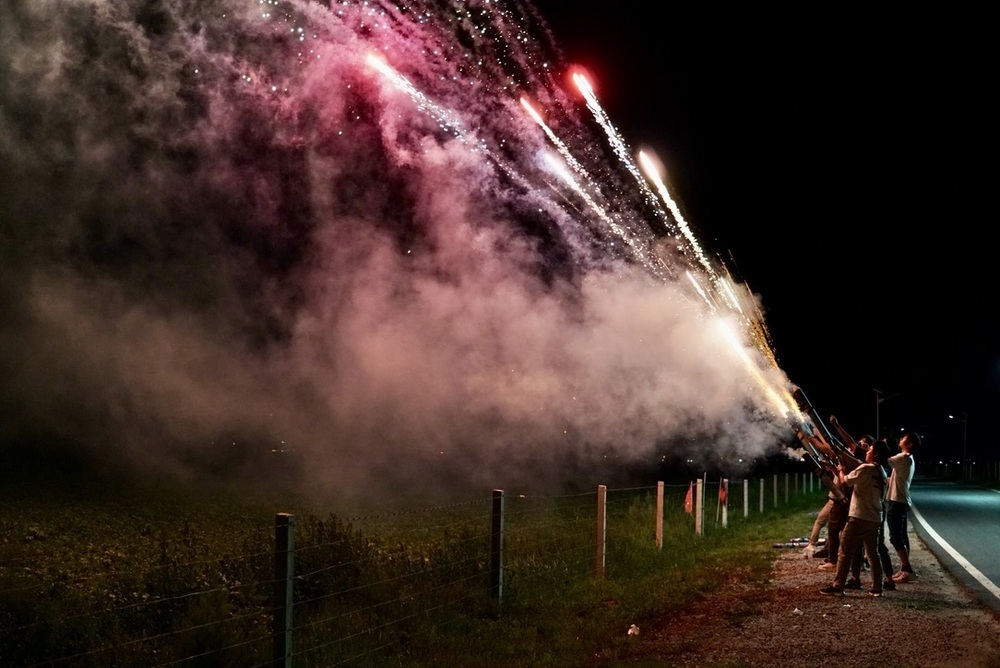
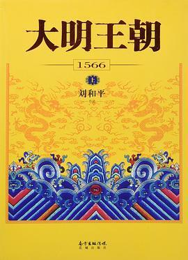
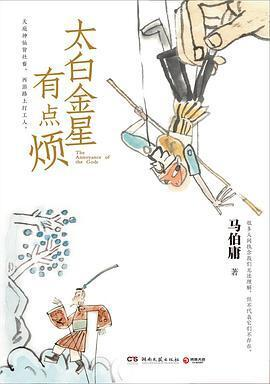
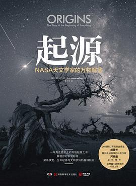
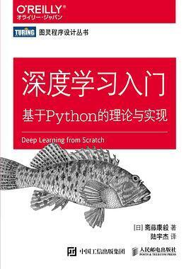
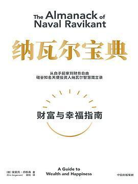
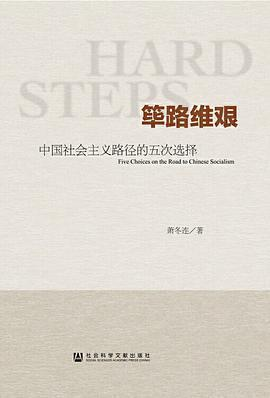

## Life - Show me your photos

The Earth keeps orbiting the sun; as time passes, we brush past life, carrying memories of the past and stepping into the unknown ahead.

Last year, I set myself a goal about life: **family and companionship**. One part was “quality time together,” and another was “learning to take pleasing snapshots.” On every trip, I wanted to capture the play of light and shadow and the warmth of the moment in photos. This year, that theme became — **Show me your photos**.

<small>Start of 2024, lighthouse by the sea.</small>

<small>Chilly early spring, out for a stroll with a festive dragon lantern.</small>

<small>From the bustle of Chaoshan to religiously diverse Quanzhou.</small>

<small>Kiyomizu-dera in Kyoto; the kid made a Zen-like wish: I hope Buddha is happy every day.</small>

<small>Lishui, terraced fields in South Zhejiang.</small>

<small>Hukou Falls, red flags and the roaring Yellow River.</small>

<small>Disney, year-end fireworks.</small>

## Work - Building the foundation

<small>Gatling-style fireworks on the grassland.</small>

This year I shifted from explorer to someone driving systematic evolution in an organized way. Early in the year I even had a sense that the skeleton of the “building” was in place—next would be steady construction to keep the flywheel moving, and I started to explore new directions in AIGC, hoping to find a breakthrough there.

Reality soon delivered a sharp wake-up call. As AIGC grew explosively, we witnessed history while facing a huge surge in compute demand. Wave after wave of pressure landed; new demands and old debt tangled together and put massive strain on infrastructure delivery. Several core colleagues in this space left within a few months. People left, but the work had to go on. From June I was on the front line with a small team.

There were times I felt close to breaking. I wrote a series of posts about “[death march](https://x.com/alswl/status/1791341868439195945).”

Pain often leads to reflection, especially when things feel unbearable—it can sharpen insight. When you’re near the bottom, the rebound can begin. At some point I understood: the problems are temporary; what we’re really building is the inner capacity to face difficulty with clarity and to see problems squarely.

No need to fear others’ judgment or to resent the messiness of collaboration. The situation and the problems are there; the solutions aren’t mysterious—the key is to face them. With a calm mind and realistic expectations, we can see the roots of problems in the chaos, spot opportunity in difficulty, and glimpse the future in the present. Real strength is drawing wisdom from each challenge and courage from each setback.

<small>Near Meiren Tui, Suzhou.</small>

## Side projects - Better than nothing

Work took almost all my time this year, so I had little energy left for side projects. Only two small ones.

[dbml-editor](https://github.com/alswl/dbml-editor), a free online DBML editor.

- DBML syntax checking and feedback. DBML is a language for describing relational database schemas; it’s declarative and often easier to read than SQL.
- Responsive web layout
- WYSIWYG
- Import/export SQL

[random-apple-music](https://github.com/alswl/random-apple-music) is a playlist that randomly picks from Douban Music Top 250 and lets you jump to Apple Music with one click.

- 🎵 Music lovers, discover new gems!
- 🍏 Random picks from Douban Music Top 250, one tap to Apple Music!
- 🎧 Endless music possibilities!

My most popular posts on X (Twitter) this year:

- 169k [English learning tips](https://x.com/alswl/status/1742558249260286368)
- 83k [Distributed systems engineering practice](https://x.com/alswl/status/1781907605239238759)
- 75k [Proxy protocol conversion with gost](https://x.com/alswl/status/1748941468277100617)
- 56k [Death march](https://x.com/alswl/status/1791341868439195945)
- 52k [Endoflife info](https://x.com/alswl/status/1754053512877781012)
- 46k [Red Alert on Steam](https://x.com/alswl/status/1769195102126153880)
- 44k [Git rebase merge tips](https://x.com/alswl/status/1753269221872771463)
- 43k [dbdiagram.io](https://x.com/alswl/status/1780990211885023699)
- 40k [cors.sh](https://x.com/alswl/status/1754759307172962496)
- 38k [24 questions every year](https://x.com/alswl/status/1748941468277100617)
- 37k [How to expand work impact](https://x.com/alswl/status/1764671403872383348)
- 21k [How to write good documentation](https://x.com/alswl/status/1791747889628430632)

## Reading - A pleasant surprise

After getting a Boox e-reader this year, my reading volume jumped. I read 34 books in total, mostly nonfiction; 10 of them I rated five stars. With Kindle gone from China, WeChat Read became the main option. I don’t own the books, but the cost dropped a lot—uploading two books per month is enough. I also changed my view on audiobooks: I used to look down on them, but now I find listening while doing chores or commuting a good way to use my brain.

[The Ming Dynasty 1566 (Douban)](https://book.douban.com/subject/26925171/)

Brilliant—the actors’ lines could almost be used as-is with no changes.

[Too Bad, Old Tai Bai (Douban)](https://book.douban.com/subject/36328704/)

Witty and fun.

[Huawei Internal Training (Douban)](https://book.douban.com/subject/26874220/)

Huawei’s management philosophy and Alibaba’s “Six Meridians” share a focus on customers and goals. Though the ideas are similar, Huawei’s manual lacks case studies, and culture is often shaped by resolving real conflicts. The book stresses direction, professionalism, execution, and self-criticism—all important for growth. Huawei started in network equipment and became a diversified tech giant; its hardware DNA may help it stay steady. Alibaba and other internet companies have had a rougher time in the market lately.

[Origin (Douban)](https://book.douban.com/subject/35328607/)

Highly recommended. It covers the origin of the universe and the birth and evolution of life. It reminded me of a documentary I saw as a kid, _The Universe and Us_. I’d like to dig into the terminology someday—it spans macro and micro physics, chemistry, and biology.

[This Is ChatGPT (Douban)](https://book.douban.com/subject/36449803/)

A master in the field explains the essentials to newcomers. Reading papers was dry and the details didn’t connect; this book helped tie it together. The Transformer attention mechanism isn’t covered much, but commenters added more in the reviews.

[Deep Learning from Scratch (Douban)](https://book.douban.com/subject/30270959/)

A solid intro to deep learning. Unlike “how to use” books, this one focuses on “how to build”—it implements a simple framework in Python and applies it to handwritten digit recognition. It walks through what each layer does, with the math and intuition. Though it’s been out for almost five years, the content still holds; the outlook at the end, including object recognition and RNN (the basis of GPT), is very relevant today.

[The Almanack of Naval Ravikant (Douban)](https://book.douban.com/subject/35876121/)

The book is like a mental massage—a short lift, but you still have to act. When I’m stuck, I need that kind of relief. Reading the chapter on emotional regulation reminded me of a recent work conflict where I lost my temper. I knew the principles; maybe if I’d read Naval’s chapter earlier I could have stayed rational. Good books deserve rereading. The chapters on wealth and judgment hit hardest: do high-leverage work to build wealth; use stable mental models; learn math, especially probability and statistics.

[Lee Kuan Yew: One Man’s View of the World (Douban)](https://book.douban.com/subject/30175059/)

As a statesman, having the will, the drive, depth of thought, and a broad view free from dogma already puts him in the top tier. What’s rare is Lee Kuan Yew’s candor—likely tied to Singapore’s size and its people. The comments on this book are dense; other readers added many angles (and what happened afterward).

[The Hard Road (Douban)](https://book.douban.com/subject/26171466/)

A remarkable book. The author, a Party history researcher, discusses at length the political and economic line disputes from the founding of the PRC to the present. He doesn’t shy away from describing Mao—I saw someone in a hurry to reach communism in one go and leave a classless society, launching movement after movement. Deng’s course correction and reform and opening up followed. Moving to think of a generation’s sacrifice—each number a broken family. I hope for less grand narrative and more attention to daily life and people’s welfare.

[At the Bend of the Gorge (Douban)](https://book.douban.com/subject/35317149/)

From obscurity to the spotlight. The writing feels sincere and plain; I was moved to tears more than once by Chen Xingjia’s integrity, warmth, and vitality. Some say it’s performance; I’d rather believe in that sincerity and hold to what I choose to believe.

[The Unvanquished (Douban)](https://book.douban.com/subject/36480389/)

_The Unvanquished_—a domestic sci-fi collection that surprised me. Mo Xiong’s style has a push toward the edge of the universe; he takes a fragment of space opera and brings it close to the reader. “The Carrier Pigeon” blends soft and hard SF, with reason and emotion bound by the speed of light. “White Ghost” reads like a power fantasy. “The Unvanquished” reminded me of the Weeping Angels in _Doctor Who_—a kind of hunt across timelines. Both the hunt and the way out are clever and unexpected.

## Last

Here’s to a new year that is both lively and quiet, deep and simple.
