> Good is the enemy of great.
>
> Jim Collins, _Good to Great_

I didn’t sit down to write this year-in-review until February. There was a lot I wanted to say, but when I started typing, the year felt hard to sum up in a few lines—as if I’d been pushed to a threshold and had just stepped across it.

---

## Life

In 2025 I kept using photos to document life.
Different light fell on different moments over the past year.
Some trips were spur-of-the-moment; others were long-planned.

I traveled, saw different places, touched history, and spent time in nature.
Coming back, I still had to return to my own life—plain and intense.

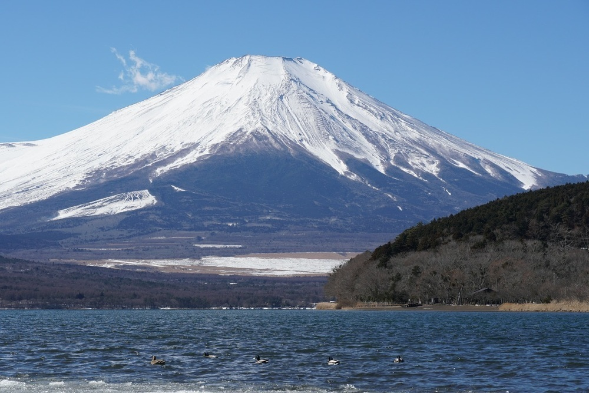

<small>Lake Yamanaka with Mt. Fuji, Yamanashi, Japan.</small>

<small>National Mosque of Malaysia, Kuala Lumpur.</small>

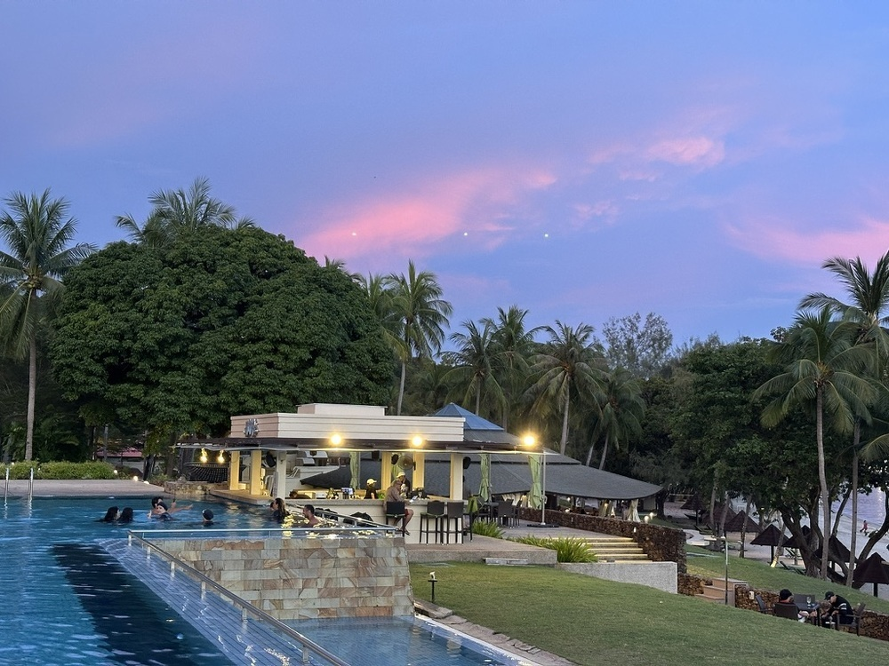

<small>Sunset at Langkawi, Malaysia.</small>

<small>Blue hour at a wedding, Yunxiang Mountain, Dali.</small>

<small>Seagulls, Xinghai Square, Dalian.</small>

Our kid has passed the age where everything they do seems cute.
School, sports, music—all kinds of expectations have kicked in.
Training a large model is hard; training the small model at home isn’t easy either,
especially when that small model showed “emergent” smarts early and has a fair share of rebelliousness. 😄

In family life, the relationship between partners is always the main pillar.
My wife and I keep adjusting in warmth, friction, patience, and dependence, looking for a way of being together that works.
A partner is the closest thing to another version of yourself in the world; a good relationship means supporting each other and exploring life together.

My OKRs from the start of the year clearly slipped, mainly because of where I put my energy—I had less discretionary time than I expected:
Reading and open source moved ahead; health and investing barely did.
By year-end I trimmed the goals and planned to drop more KRs, keeping only career, family, and health.
Fewer goals help me stay steadier and more focused, and I don’t have to keep weighing priorities in my head.

## Work

Looking back at the year, it’s hard to describe in one word.
It was both busy and formative.

I’d pick three keywords: leap / black swan / Be True.
They map to three kinds of change: capability, environment, and how I see people.

Early in the year I kicked off an infrastructure project, responsible for delivering group-wide compute.
With AI inference scaling fast, that piece of the business grew sharply.
I’d taken over group compute delivery around mid-’24 and had been at the edge of the cliff;
it took a lot to get through the storm and stabilize.

The difficulty wasn’t mainly tech or engineering—it was problem definition, consistent delivery, and rigor in the loop.
Cross-BU collaboration, legacy systems, fuzzy ownership, and very high stability requirements.
With more investment, attention, and ongoing tech upgrades, the project was in a good place by year-end.

Mid-year I took over the team. I knew the domain and the systems well, but how to get things done and grow people was new to me.
For a while I was even dreaming about product and business direction.
Things settled after some time: progress doesn’t come from brute force; it comes from engineering and product discipline and from reading the times.
I kept thinking about how to run the team well and landed on two words: Be True—do the right thing, be yourself, to others and to yourself.

I put together a reading list on teams and organizations here:
[Be True — Teams and Organizations](https://www.douban.com/doulist/163363861/)

In December we hit a black-swan production incident. I won’t go into details, but the impact was deep.
It wasn’t truly random. Technical debt, unclear ownership, and weak safety practices were bound to blow up at some point.
The “black swan” was more about the unpredictability of complex systems.

How to deal with that uncertainty? In engineering, it always comes back to first principles: define the problem, then solve it.
In business and team, it’s about staying close to customers and solving real problems; change only shifts the path.
When you’re in the storm, don’t let others define you—define yourself clearly.

This year, AI’s impact on engineering became concrete.
In June I was still skeptical about AI coding, thinking infrastructure would have a longer buffer because of context and experience,
but in practice that wasn’t the case. With AI coding tools, development speed went up, repetitive work went down, and exploration cost dropped.
Code typing will become the inefficient way to build; AI-native should be the default.
AI lowers the bar for execution and amplifies the gap in decision quality.
The capability gap isn’t closing—it’s being amplified: engineer value is shifting from implementation toward problem choice and constraint design.

## Personal Growth

I barely wrote on the blog this year, though I kept some internal posts going every month; I put very little into the open community or visible self-growth.

Looking back, around Spring Festival I decided to finish the Duolingo English path within the year.
I hit level 130 in 278 days—from early spring into autumn.
After that I focused on listening practice with YouTube and Bilibili.

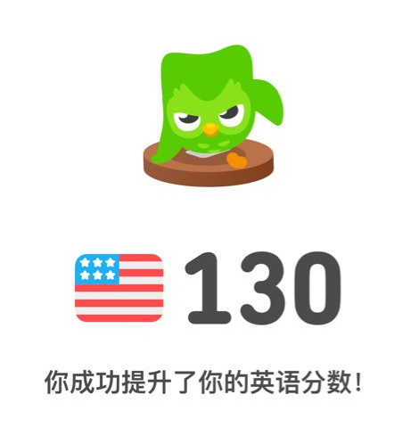

Books remained my refuge. However busy work got, I could still find clarity and answers in what I read.
Last year I aimed for depth and simplicity; this year I added more philosophy and organization to the mix.

My former manager shared his reading notes in the larger team every month, and I learned a lot from that.
It felt like a rare kind of sharing—I’ve always seen reading as somewhat private—but the format helped me a lot
and expanded my list. I’d like to try that kind of exchange more: less worry about feedback, more focus on why I’m doing it.

### [No Rules Rules: Netflix and the Culture of Reinvention](https://book.douban.com/subject/35102294/)

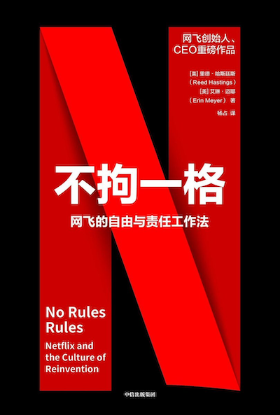

Netflix takes a different view of talent.
They pay at the top of the market and don’t stack-rank;
they keep people who meet the bar.
They give employees a lot of trust and use review after the fact.
Decisions are context-driven (north star), not control-driven—Context, not Control.

What can managers do right away?
First, increase transparency and give people more say in technical decisions,
then track outcomes and do proper retrospectives.
Second, in meetings—especially monthly and weekly—keep clarifying and aligning the team’s north star.

### [Do Androids Dream of Electric Sheep?](https://book.douban.com/subject/36701790/)

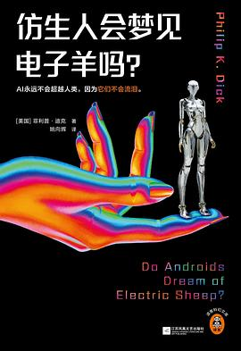

Where is the line between human and artificial?
If it looks like a duck, quacks like a duck, is it a duck?
The question echoes across time to every LLM and agent.

### [The World of Code by Yukihiro Matsumoto](https://book.douban.com/subject/6756090/)

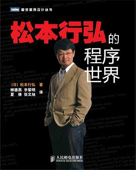

I’d wanted to read Matsumoto’s book for over a decade—
back then I even interviewed at a Ruby startup.
I didn’t finish it until more than ten years later.

The book reviews then-popular languages from a master’s perspective
and explains the thinking and taste behind Ruby.
It also discusses the impact of the cloud, growing compute, and the rigor of distributed systems.
That high-level view keeps most of it relevant today.

Time passed; Ruby stayed mostly in the web world,
Python rode AI to a comeback.
NoSQL found its steady state; GPUs took the high ground in compute.
Dart is basically done. Ha.

I wish Matsumoto would write another book like this.

### [Twelve Lectures on the History of Western Thought](https://book.douban.com/subject/34971549/)

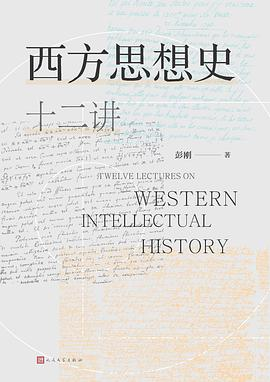

Exploring the cosmos, the self, existence, and truth—that’s what the history of Western thought is about.
Countless claims have been made; they had to be logically consistent,
and either serve human meaning, religion, or the state—
in short, fit the era and the powers that be.
I wonder if students of philosophy feel that it moves too slowly,
decades or centuries for a small step, out of sync with the pace of technology.
But perhaps precisely because things change so fast,
we need some sense of stability and certainty about ourselves and the world.

### [Good to Great](https://book.douban.com/subject/1059769/)

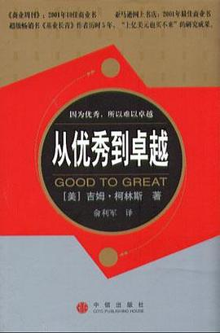

The book looks like it’s for leaders of great companies,
but who doesn’t want to be great from the start? Late bloomers can learn from the best too.
The core is: people, thought, action, and sustained buildup.
Great companies need Level 5 leaders (humility, will, consistency).
They need direction, vision, and strategy.
The hedgehog concept: what you can be best at, what you’re passionate about, what drives your economic engine.
Distinguish belief (aiming for success) from principle (facing difficulty).
A classic that repays rereading.

### [High Output Management](https://book.douban.com/subject/27178870/)

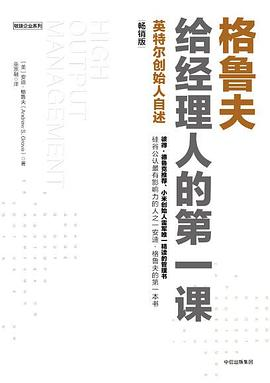

Focused on the essence of management: raising team leverage; identifying the limiting step; managing objectives, time, and performance.

### [Seeing the Child: Insight, Empathy, and Connection](https://book.douban.com/subject/36427596/)

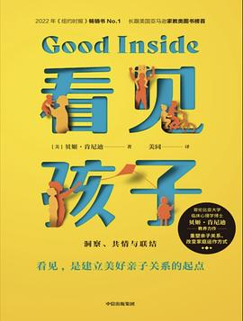

There’s no such thing as a child who is simply “not good enough.”
The key is to respond to real needs with patience and understanding,
and to stay emotionally steady enough to hold the child’s emotions even when things are hard.
Doing that isn’t just about raising the child—it’s also a way of reparenting yourself.

### [Xiaomi’s Entrepreneurial Thinking](https://book.douban.com/subject/36057097/)

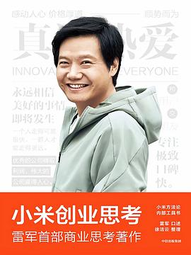

Very honest and useful.
I didn’t expect much from the Xiaomi story—assumed it would be the usual founder narrative.
After reading, Lei Jun really lays it out:
from mission and strategy to macro direction and micro management,
nothing held back.
Sometimes it feels like management has become a genre,
but from what I see, the world really is a “stage crew”—some big, some small.
Lei’s book maps classic management ideas onto reality.
Those ideas deserve to be told again and again, learned again and again.

### [The Worlds I See: Fei-Fei Li’s Memoir](https://book.douban.com/subject/36672955/)

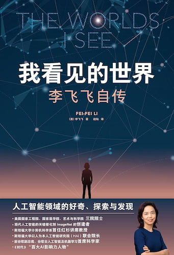

See one of the few posts I wrote this year:
[How did Fei-Fei Li succeed? — Reading “The Worlds I See” | Log4D](https://blog.alswl.com/2025/06/li-feifei/)

### [In the Midst of Reform: Chinese Government and Economic Development](https://book.douban.com/subject/35546622/)

Five stars. Understand the Chinese economy.

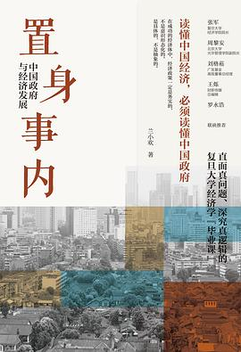

### [Chip Wave: Global Competition Behind Nanometer Process](https://book.douban.com/subject/36462444/)

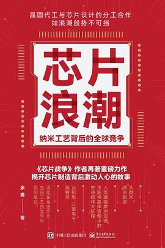

This book is almost a history of TSMC,
from Taiwan’s efforts to attract investment and Morris Chang’s arrival,
to the foundry model and breakthroughs into the nanometer era—a gripping read.
The era offered opportunity; it took strong players to seize it.
Calculated risk, leapfrog development, and American-style management all left a mark.
I also understand SMIC better now. Onward.

### [The Effective Executive](https://book.douban.com/subject/1322025/)

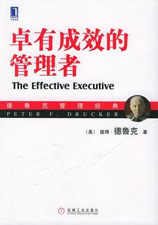

Recommended for everyone who works at a computer.

Not only team leads are executives—knowledge workers are executives too.
Drucker gives five pillars: time management, focus on contribution, build on strengths, first things first, effective decisions.
For the average knowledge worker, I’d start with time management, then OKR and key decisions.
For decisions: research well, find the core issue, know your edge, think ahead.
If you ever lead a team, keep investing in people’s strengths.

I’ve written a bit on a couple of these:
Time management: https://blog.alswl.com/2023/02/gtd/;
Decisions (technical): https://blog.alswl.com/2023/07/architecture-design-the-easy-way/.
I’ll try to write on goal management this year.

Every time I revisit Drucker, I’m struck by how he gets to the essence. A book that repays rereading.

### [My Rebirth Diary](https://book.douban.com/subject/37467106/)

If life is like a long dream, level after level, hardship after hardship, what do you do?
This book is about the author’s experience with illness.
We’re living longer; illness will touch us or our families sooner or later.
The book is like an honest friend, sharing what it’s like after getting sick.
The author’s days were very hard; the book doesn’t hide that.
He fought the illness and kept encouraging himself—
the writing feels real, and you feel his fear, persistence, and will to live.
There’s only one way through the storm: go through it.

### [A Brief History of Japan](https://book.douban.com/subject/35540708/)

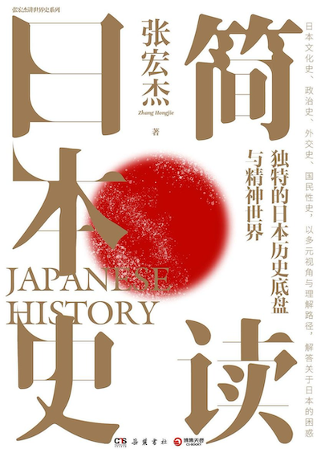

The majesty of Mt. Fuji is still vivid.
Walking through the Tokyo National Museum, I had a vague sense that the early history felt thin,
some ceramics underwhelming—until the Edo section, which stood out.
After this book I understood: before the Taika Reform, Japan was indeed less developed,
which explains why the early museum pieces felt weaker.

“Mountains and rivers in different lands, wind and moon under the same sky”—we know the line; some say China and Japan share script and roots.
But Japan’s path was its own:
disorder, chaos, poverty, insecurity, and explosive change.
Today Japan is one of the key representatives of East Asian civilization,
with its own spirit and national character—
linked to China by culture, yet on a different path.

### [The DevOps Handbook (2nd Edition)](https://book.douban.com/subject/36868981/)

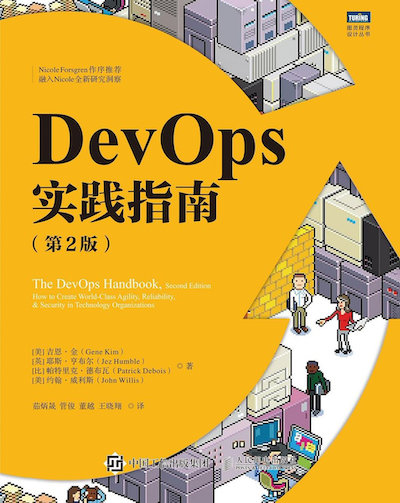

I initially underestimated this book, thinking that after years in the field the ideas would be familiar.
Reading it, I found it clear and well-structured,
with concepts laid out more rigorously than I’d assumed.

A few points that stood out (some counterintuitive):

1. Value stream matters for DevOps—help upstream and downstream teams with their problems.
2. Authority and scope must match; setting goals is critical.
3. Spend 20% of time on invisible positive value.
4. Create flow—from source to product.
5. Designate an ops liaison; avoid many-to-many contact.
6. Build feedback loops; early on, dev owners should run ops; if quality drops, hand back ownership.

### [Das Kapital](https://book.douban.com/subject/4267216/)

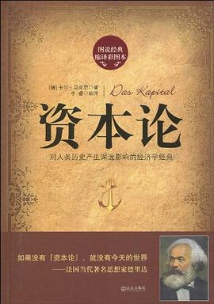

Capital isn’t a monster; capitalism isn’t a monster either.
Will capitalism’s endgame ever arrive?
Could we reach a state where multiple forms of capital balance each other?
Governments use antitrust to limit unchecked expansion
and basic welfare to protect the bottom.
The third volume argues that profit-seeking is fundamental.
But profit-seeking is basic to any organization; people seek profit too.
What’s wrong with businesses seeking profit?
Profit-seeking is a sign of life, of existence—as long as it doesn’t become a social cancer.
Is a financial crisis always bad?
Could it be a de-foaming, cooling process—and if orderly, even beneficial?
Overall, Marx describes the worst outcome of capitalism under disorder, weak government, and fragmentation,
and its eventual replacement by socialism.
Capitalism is a tamed beast; it needs a leash and government regulation,
whether that government is separation-of-powers or centralized.
I suspect that for the foreseeable future, reformed capitalism will persist,
balanced by governance and antitrust.

### [On China](https://book.douban.com/subject/26607419/)

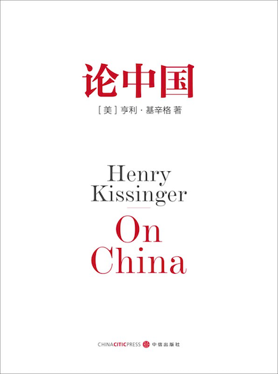

_On China_ splits roughly into two parts.

The first is the history of China’s foreign relations from late Qing to the founding of the PRC.

The second is Kissinger’s own role in U.S.–China relations. Kissinger is a fascinating figure—he can seem pro-China on the surface but is fundamentally driven by national interest. He was lucky enough to work closely with four (perhaps five) generations of Chinese leaders; he’s like a living fossil of modern history.

Pulling the lens in and viewing the process through a diplomat’s eyes makes the era feel more concrete.

Related viewing/reading: Bilibili’s “The Last 13 Years of the Qing Dynasty” by Elephant Studio; _Deng Xiaoping and the Transformation of China_. (I haven’t found a single strong book on Mao’s later years.)

## Closing

In 2026 I’ll keep exploring the world, investing in family and parenting, and contributing more in Infra and AI Infra.

The tipping point isn’t the end—it’s the launch.
