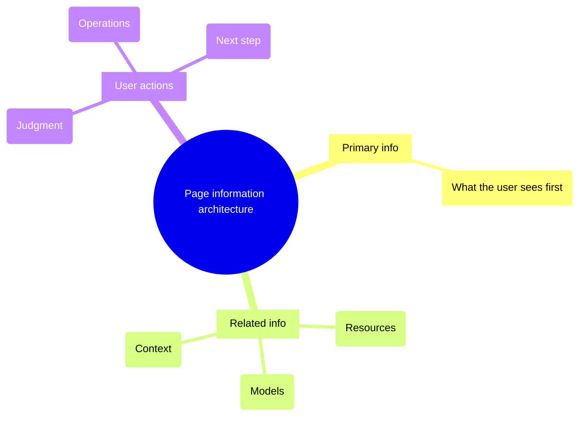
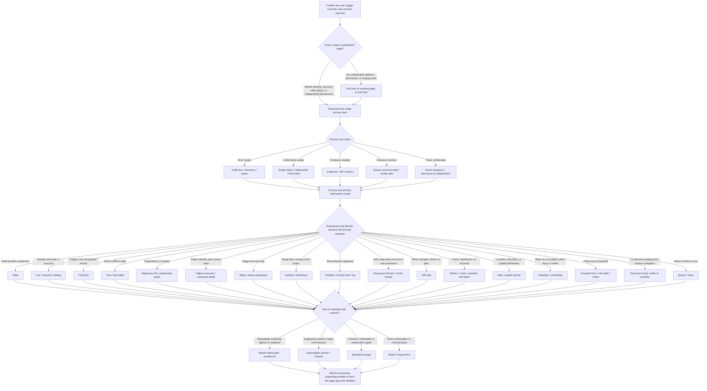

Recently I started building the frontend for an infrastructure project myself. AI can put a page together in no time — CRUD, filters, status badges, nothing missing — and at first glance it even looks the part.

But once you actually use it, the awkward parts show up: the page is full of information, yet you don't know what to look at first; related resources, context, and status are scattered everywhere; and figuring out what to do next is on you, pieced together from a pile of fields.

The components weren't the wrong choice. The problem was that I treated it as a CRUD page from the start: list the fields first, then bolt on filters and actions, and only at the end realize the user still doesn't know where to begin. The data was all there, but the page never helped the user order understanding and action.

Later I organized the judgments I would make myself into a page-organization guide. Tables, kanban boards, calendars — the basic ways of organizing information — I collectively call "expression skeletons" in the guide.

## When Everyone Starts Writing Product Pages

My work has always been backend-heavy. I'm interested in frontend and other technologies and experiment with them now and then, but what I actually put my hours into was the backend. Recently the team's frontend capacity shrank, and I started owning frontend projects myself.

This time I didn't set out to design a component spec from scratch; I chose Ant Design plus Ant Design Pro as the foundation. The reason is practical: the tables, forms, layouts, navigation, and descriptive details common in enterprise backends all have fairly mature off-the-shelf solutions, and it's easy to keep page shells and component behavior consistent. With the basics handed to the component library, I can spend my time on how information is organized and what users see first.

That spec doesn't make decisions for the page. It just fixes the starting point of implementation so that every page doesn't reopen the discussion of colors, spacing, and component styles. What still needs judgment is which object the page centers on, and what users intend to do with the information.

This brought me back to an old problem: code written doesn't mean the page is designed. The gap is especially visible when AI writes the frontend. It can supply components, styles, and interactions, but it doesn't know what a user should understand first upon arriving, what to judge, or what to do next.

I wanted to pull out my solutions and judgments in this area so the rest of the team could use them too. A page "looking off" is usually just a feeling; only when you can say concretely that the primary information doesn't hold up, related information is scattered, or actions are misplaced can you discuss it together — or hand it to AI to fix.

This page-organization guide is one part of that. It's my own checklist when writing frontend, and I hope it becomes a shared set of judgment criteria for the team when applying AI to frontend projects.

## How to Organize the Information Architecture

When I look at a high-density page, I usually don't go hunting for components first. Get the three questions below clear, and everything after becomes much easier.

1. What matters most for the user to see when they open the page?
2. To understand that primary information, which related resources, models, and context also need to be visible?
3. After reading, what reaction or action should the user take, or what should they keep thinking about?

Walking through these three questions first at least tells me what the user is here to do. Once that's clear, coming back to table vs. kanban vs. calendar rarely goes far wrong.

The current demo is built with Ant Design. The judgment itself has nothing to do with the component library; on another stack, the concrete components need adapting to the project.

## From List and Detail Toward Richer Ways of Organizing Information

CRUD is great at data operations, and list and detail pages remain useful. They mainly answer "how do I create, read, update, delete this record", though — not what the user should look at first after arriving, what feedback they need, or which information a decision should rest on.

The API only hands over data and operations; the page still has to lay out the relationships between them: what the user looks at first, what they compare next, and where they finally act.

## A Worked Example: GitHub Projects' Information Layout

[GitHub Projects' layout documentation](https://docs.github.com/en/issues/planning-and-tracking-with-projects/customizing-views-in-your-project/changing-the-layout-of-a-view) makes a great comparison. The same project item can go into a table, a board, or a timeline-style roadmap. The data hasn't changed; the way the user reads it has.

Take a batch of pending dev tasks and hold them against these layouts, and each of the three views pulls attention somewhere different:

| Question at hand                                              | Information to place together   | Expression skeleton to choose       |
| ------------------------------------------------------------- | ------------------------------- | ----------------------------------- |
| Which tasks take priority, and who owns each?                 | Priority, owner, similar fields | Table — compare and sort by columns |
| Which tasks are in progress, which are done?                  | The stage each task is in       | Kanban — group by status            |
| When are these pieces of work scheduled, and do they overlap? | Start and end dates, duration   | Roadmap — observe on a timeline     |

When planning the next round of work, I put priority and owner in fixed columns, sort, then read down the rows for the split of work. With cards, the same field no longer sits in a stable spot, and comparing means hunting back and forth. The value of a table here is simple: comparison happens in a fixed place.

When tracking progress, I care about "what's still in progress". Laying tasks into columns by status — find the stage first, then the items inside it — matches that motion. If you can drag a card to advance its status, the page's layout and the operation click together too.

When scheduling delivery, knowing "in progress" isn't enough. Put start and end dates on a timeline and overlaps between work items show up immediately. Whether they genuinely can't be staffed still comes back to owners and workload.

A backend page doesn't need all three views. If the page mainly serves one task, get that one right first; add a view only when there really are multiple high-frequency uses. Every extra view adds maintenance cost to filters, statuses, and actions.

[Notion's database views](https://www.notion.com/help/views-filters-and-sorts) are a similar example. When preparing to publish a batch of content, switch to gallery to pick covers, switch to calendar to check publish dates. The calendar shows me the distribution of dates, but it won't tell me on its own whether resources conflict; answering that needs time ranges and resource occupancy.

I also watch how other products handle similar problems. What strikes me most about GitHub is that it always unfolds around one core object, in no rush to cram everything in. Twitter is more like taking the same object and handling it in different contexts. Taobao faces enormous data volume, yet products and trading actions always stay prominent. Douban has many data types, yet each of its pages has its own organization. You can't copy their styles directly, but when I look at these pages, I pay attention to what the user is actually there to do.

So now I first state clearly what the page is for: when users arrive, what exactly should they understand, compare, or advance? That finds direction more reliably than starting from "build a modern admin".

## How to Choose the Right Information Structure

Section 2.2 of the guide draws this selection process as a complete path: first see what objects and relationships exist in the system, then what the user needs to accomplish, then judge the inherent structure of the information, and only then land on a concrete form of expression.

Don't build a table just because the API returned an array, and don't default to a detail page just because there's an ID in the route. The same object may need a list when users are searching, a status flow when they're processing, and a discussion thread when they're collaborating.

The full decision tree in the guide keeps probing the primary task and primary question. Field-by-field comparison suits a table; when images are the recognition anchor, a card grid works; stage transitions suit a kanban; only time occupancy and conflicts call for a calendar. A record having a date only means the data contains a date — it doesn't by itself decide which structure the page should use.

After choosing, I walk through the real operations once more: is the most-compared information placed together, is the most common action right there beside it. If the user still has to reopen details repeatedly, memorize the previous record and come back to compare, the structure and field arrangement probably need another look.

## When List and Detail Aren't the Answer: Cards, Kanban, Calendars, Dashboards, and More

The demo turns these judgments into several sets of pages you can open directly. When looking at a page, I mainly ask: if the user needs to recognize by image, advance status, schedule time, or spot anomalies, which information should appear first?

The demo code lives in the [`fe-page-guide-antd-demo`](https://github.com/alswl/guides/tree/master/fe-page-guide-antd-demo) directory of the [`alswl/guides`](https://github.com/alswl/guides) repository. It's a runnable companion project: built with Vite + React 18 + TypeScript, page fundamentals handled by Refine, UI in Ant Design v5 and Ant Design Pro's ProComponents. The data is in-memory mocks; each of the 19 expression skeletons maps to one route, so opening it shows exactly what each page looks like.

These pages share one stack, which makes it easier to see in comparison that the differences come from how information is arranged, not from a swapped component library.

### Card Grid: When Recognizing the Object Comes First

When picking assets or templates, users usually look at the thumbnail first to confirm it's what they're after. Images should be the main entry at moments like this. If fields like price and specs also need comparing, a table may be less effort.

With templates, I usually recognize the layout first, then read the name. Shrinking the preview into a tiny image on the far left of a table squeezes out exactly what matters for recognition. Cards put the preview in a prominent spot with the name and other fields arranged around it. If every choice requires checking a pile of parameters, big images alone won't carry it.

### Kanban: Making Stages Visible at a Glance

What matters most in a kanban is what the columns mean and how cards move between them. Users read the distribution of stages first, then decide how to advance. If you're just filtering tasks by owner, a list is already enough — no need to force it into a board.

Column names like "To do, In progress, Done" express progress through position itself. Keeping identifying information — title, owner — on the card is enough. If a column is just a filter with another name, users will find it tiring to read and not necessarily faster to operate.

### Calendar and Scheduling: Spreading Time Occupancy Out

Calendars suit things genuinely about time occupancy — shift scheduling, meeting room booking. If you only want to know whether an approval was submitted or approved first, a timeline is more direct.

When booking a meeting room, the user needs to know immediately whether a slot is taken — start and end times can't hide in a detail page. Approval records are different: the point is event order, and a timeline laid out chronologically is enough.

### Dashboard: Organizing Metrics by Question

Dashboards most easily become a pile of equal-sized cards. What should be seen first is how the metrics relate to each other, and the order in which users go from overview into detail.

If every metric sits in an identical card, users still have to guess which ones belong together. I group by question first: which numbers detect anomalies, which trends explain changes, where the drill-down entry belongs. Plenty of information doesn't mean every block should fight for attention.

### Hierarchy Tree: Preserving Where Objects Belong

Trees fit information where "I need to know what it belongs to". Org structures and category directories need parent-child relationships preserved; if users often search across levels, add a list or a search box.

When drilling down through a directory, a tree preserves the sense of "which level am I on". When the name is known and the goal is quick location, search is faster. Both entries can coexist — don't make users expand the whole tree level by level to find an item they already know.

### Status Wall: Spot the Anomaly First, Details Second

A status wall first answers a very practical question: where exactly is the anomaly. A monitoring page can be dense, but colors, decoration, and status markers must not fight each other.

The user locates the object that needs attention, then digs in for the cause. Object names and statuses must be easy to tell apart; detailed logs can wait for the next step. Color does help scanning, but pair it with text or other markers, otherwise users will struggle to say precisely what they're looking at.

## Reference Table: Nineteen Ways to Present Information

Here are the remaining pages side by side; click any image to open the full-size original.

| Expression skeleton                                                                                                                            | Expression skeleton                                                                                                                                    |
| ---------------------------------------------------------------------------------------------------------------------------------------------- | ------------------------------------------------------------------------------------------------------------------------------------------------------ |
|  Sectioned detail             |  Two-way comparison table       |
|  Catalog & discovery |  Card grid                                 |
|  Hierarchy tree                     |  Relations list                   |
|  Step wizard                       |  Trace drill-down               |
|  Kanban                                   |  Status wall                     |
|  Event timeline             |  Discussion thread           |
|  Continuous document             |  Side-by-side compare           |
|  Map & canvas                   |  Calendar scheduling           |
|  Dashboard                     |  Master-detail workbench |
|  Config form                       |                                                                                                                                                        |

## Handing the Guide Directly to an Agent

The guide can go straight into a project repository as a reference when AI reviews frontend pages. The human starts from the business — think through what users are here to accomplish — then decides the information structure and expression skeleton; AI builds on those judgments to fill in proposals, find inconsistencies, and make the changes.

You can hand the following directly to an agent:

> Page organization guide URL:
>
> https://github.com/alswl/guides/blob/master/fe-page-guide-antd.md
>
> First read the page organization guide and inspect the current project's directory structure. Following the project's existing documentation conventions, copy the guide to an appropriate location; if there's no better directory, put it at docs/fe-page-guide-antd.md. After copying, tell me the actual saved path — don't just treat the remote URL as a reference.
>
> Review the current project's task management page. This page is mainly used to compare task priority and owner, while also showing the stage each task is in.
>
> Combining the requirements, the page source, and the actual page, produce a review of the information architecture and page expression along with improvement suggestions: list the primary information, related information, and the actions the user needs to complete; state whether the current expression skeleton fits, what the concrete problems are, which parts of the guide they violate, and what page structure you recommend. Flag any business intent that can't be determined from the available material.
>
> Send me the review findings and the improvement plan first, and wait for my confirmation before changing the page. Preserve existing business functionality, permissions, and data interactions, and keep the project's component library. After the changes, run the project's existing checks, verify field comparison, status transitions, and similar operations in the page, and provide before/after screenshots plus any issues that still need human judgment.

Swap in your own business for the page and task descriptions. AI can list candidate options, but the main skeleton and the order of information can't rest on its output alone — the business starting point must be set by a human.

Review reports must land on specifics. Saying only "the information hierarchy is unclear" isn't much use; state which information belongs together, where it's currently scattered, and how you plan to fix it. Only then can you tell whether AI solved the real problem.

Putting the guide in the repository only gives AI a reference. You also need to tell it the page entry point and the main task. If AI can only see the source, do a source-level review first; once the page runs, add screenshots and real interaction verification.

At acceptance, I still walk the real task end to end: is information easier to find, is the next action clearer, do the original filters, permissions, and data interactions still work.

The [guide and demo repository](https://github.com/alswl/guides) holds the complete rules and examples. As for whether a page is actually good to use — that still takes a real pass through the concrete business.
